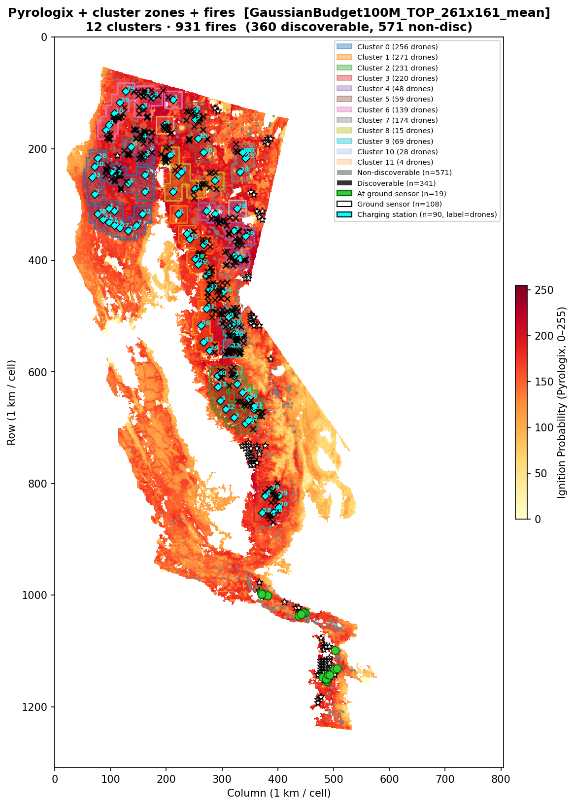
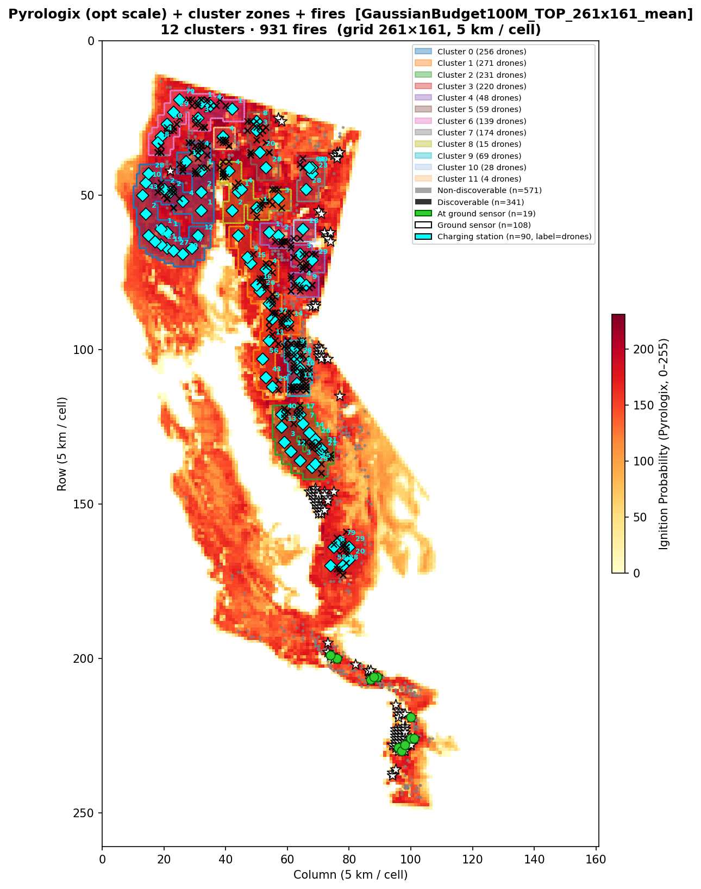

# Benchmark Report — 100M Budget, California 2021

**Date:** 2026-03-12
**Script:** `run_benchmark_california2021_yearly.py`
**Results file:** *(routing TBD — run with `--budget 100`)*
**Risk map:** Pyrologix Ignition Probability (static, 2006–2020 training, no data leakage for 2021)

---

## Setup

### Budget allocation

| Component | Count | Unit cost | Subtotal |
|-----------|------:|----------:|--------:|
| Ground sensors | 108 | 100k | 10.80M |
| Charging stations | 90 | 150k | 13.50M |
| Drones | 1514 | 50k | 75.70M |
| **Total** | | | **100M** |

### Simulation parameters

| Parameter | Value |
|-----------|-------|
| Grid | California 2021 WFPI/Pyrologix, 1309×805 (~1 km/cell) |
| Operational grid | 261×161 (5×5 coverage blocks) |
| Drone speed | 600 m/min |
| Coverage radius | 2900 m (~2.9 km) |
| Battery (max) | 1 h = 7 operational substeps |
| Transmission range | 50 km |
| Scenarios benchmarked | 100 random fires (seed=42) from 931 valid |

### Sensor placement strategy

**Strategy:** `SensorPlacementMaxCoverageGaussianTimeMaskedBudget`
ILP solved with Gurobi (time limit 600 s, academic licence).

- **MIP gap at termination:** 0.16% (TIME_LIMIT; solve 609 s, preprocessing 13.6 s, model creation 39.7 s)
- Placement saved to: `California2021Dataset/logs/sensor_alloc_GaussianBudget100M_TOP_261x161_mean.json`
- Risk map used: Pyrologix ignition probability (mean-pooled to operational scale)

### Drone routing strategies (when run)

Same as 20M: **TOP** and **MaxCov** on the same placement. Routing benchmark to be run separately.

---

## Cluster structure

| Type | Count |
|------|------:|
| Singleton clusters (1 station) | 2 |
| Multi-station clusters | 10 |
| Total clusters | **12** |

A fire scenario is **discoverable** if its ignition point (opt-space) is within L∞ ≤ 3 of at least one charging station.

---

## Benchmark fire locations

Same 100 fires as 20M report: [benchmark_fire_locations_budget_2021.png](benchmark_fire_locations_budget_2021.png).

---

## Sensor placement maps

### Data scale (1 km/cell)




### Operational scale (5 km/cell)




---

## Detection results

*(To be filled after running routing benchmark.)*

---

## How to run (100M)

**Sensor placement only** (if not already done):

```bash
python-jl run_benchmark_california2021_yearly.py --sensor-only --budget 100
```

Then fill this report and generate placement figures:

```bash
python report/fill_placement_report_2021.py
python visualize_sensor_placement_2021.py California2021Dataset/logs/sensor_alloc_GaussianBudget100M_TOP_261x161_mean.json --scale both --tag _100M
```

**Full benchmark (placement + TOP + MaxCov routing):**

```bash
python-jl run_benchmark_california2021_yearly.py --budget 100
```

Results will be written to `benchmark_results_yearly_YYYYMMDD_HHMMSS.csv` in the project root. Re-run `report/generate_benchmark_report_figures_2021.py` (extended for 100M if needed) to update detection maps.
