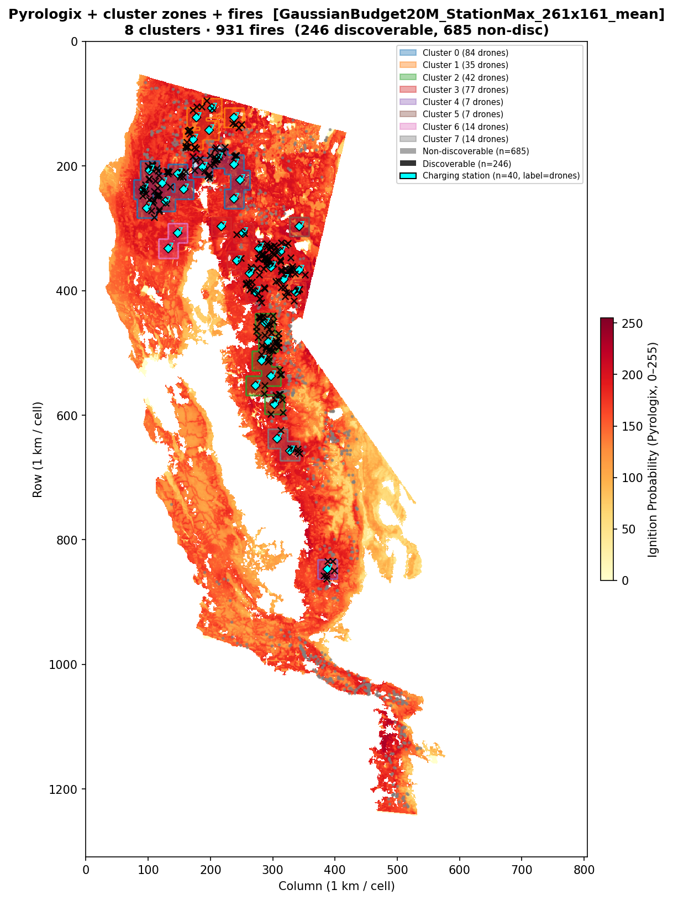
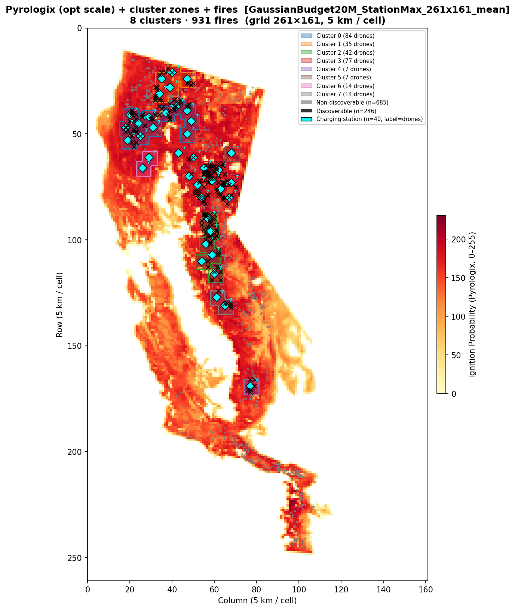
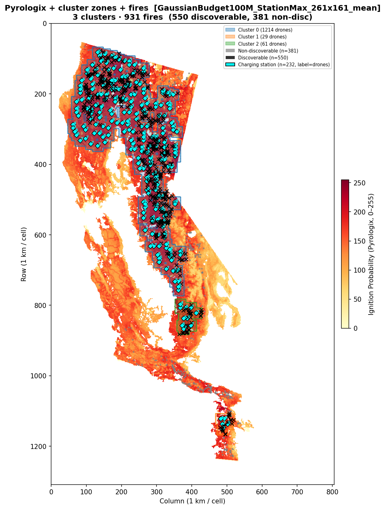
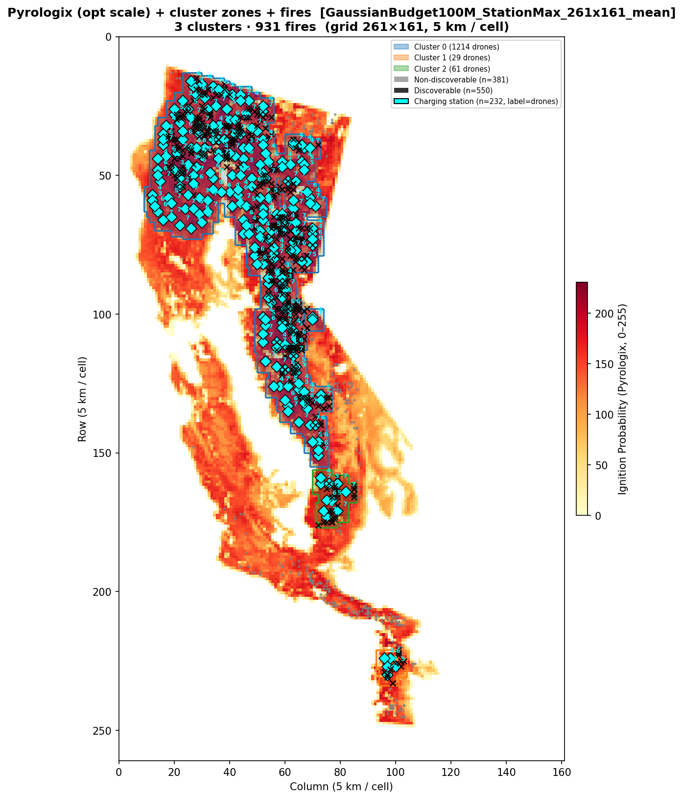
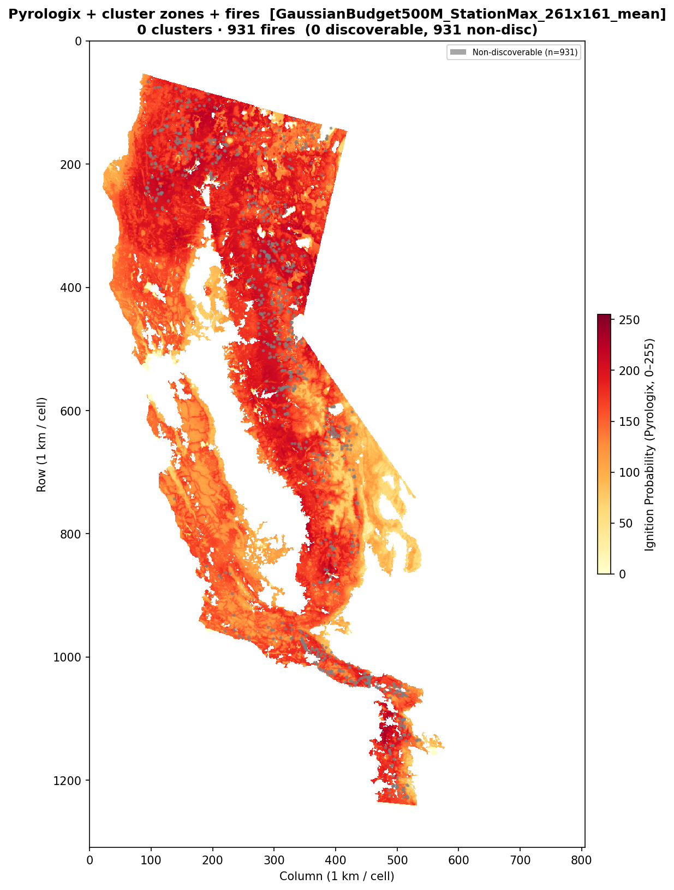
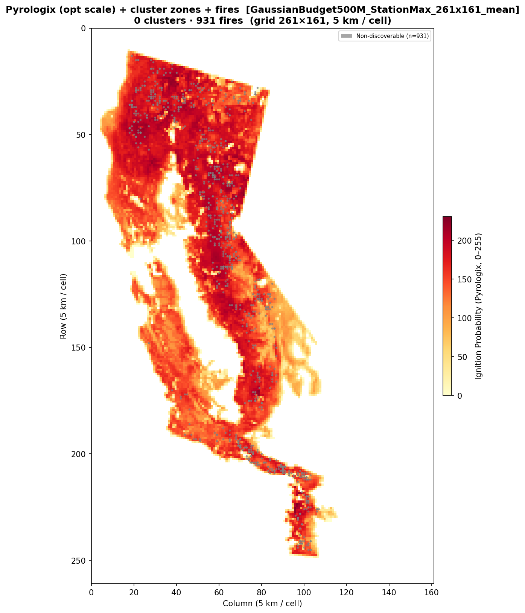

# Benchmark Report — California 2021 Greedy Kernel

**Date:** 2026-03-13  
**Dataset:** California 2021  
**Risk map:** Pyrologix ignition probability (static, trained on 2006–2020, no data leakage for 2021)

---

## Overview

This report summarizes a placement-only benchmark on the California 2021 dataset
using the new **StationMax greedy-kernel** sensor-placement strategy.

Main ideas:

- Coverage from **different charging stations does not add** at a cell.
- For each cell, only the **best contributing station** is counted.
- Same-station multi-drone coverage is modeled through **precomputed heuristic
  coordinated kernels** for `k = 1..7` drones.
- Candidate station-cell pairs are pruned to those within **one-way reach**
  `floor(max_battery_time / 2) = 3` operational cells.

This report covers the three budget levels requested:

- **20M**
- **100M**
- **500M**

The 20M and 100M runs produced meaningful placements. The 500M run did not find
a useful incumbent within the 10-minute cap and therefore returned an empty
placement; this is documented explicitly below.

---

## Heuristic Kernel Construction

For each candidate charging station:

1. Build the local `7 × 7` operational patch corresponding to one-way reach
   `<= 3`.
2. Enumerate masked shortest paths from the station to every reachable cell in
   that patch.
3. Greedily pick up to `Kmax = 7` paths:
   - drone 1 takes the path that covers the most still-uncovered cells,
   - each additional drone takes the path with the largest remaining marginal
     gain.
4. The `k`-drone kernel is the **union** of the first `k` selected paths.

This is an optimistic coordinated-routing surrogate: drones from the same
station are encouraged to spread out, but the preprocessing stays cheap because
it only solves tiny local shortest-path problems.

Across stations, the optimizer uses a **max-over-stations** coverage model
instead of linear addition.

---

## Common Setup

| Parameter | Value |
|-----------|-------|
| Data grid | `1309 × 805` (~1 km/cell) |
| Operational grid | `261 × 161` (5 km/cell) |
| Drone speed | `600 m/min` |
| Coverage radius | `2900 m` |
| Battery | `1 h = 7` operational substeps |
| One-way reach used in pruning | `3` operational cells |
| Candidate pre-filtering | top 20% by risk / coverage potential |
| Solver | Gurobi |
| Time limit per run | `600 s` default; `1800 s` for the final 100M rerun |

---

## Fire Locations

The same California 2021 fire sample/background map is used for all three
budgets. Background is the Pyrologix ignition probability map.

---

## Summary Table

| Budget | Status | Gap | Preprocess | Model creation | Solve | Allocation summary |
|--------|--------|-----|------------|----------------|-------|--------------------|
| 20M | `TIME_LIMIT` | **0.37%** | 2.37 s | 3.59 s | 601.61 s | 0 sensors, 40 stations, 280 drones |
| 100M | `TIME_LIMIT` | **9.6%** | 2.28 s | 3.08 s | 1801.61 s | 0 sensors, 232 stations, 1304 drones |
| 500M | `TIME_LIMIT` | unusable | 3.02 s | 3.80 s | 602.20 s | no useful incumbent found |

Notes:

- The 500M run returned objective `-0.0` and an empty placement. That should be
  treated as **failure to find a meaningful feasible solution within the cap**,
  not as a valid benchmark result.
- The 100M entry above reflects the **30-minute rerun** (`1800 s` cap), which
  substantially improved the gap relative to the original 10-minute run.

---

## 20M Budget

### Allocation

| Component | Count | Unit cost | Subtotal |
|-----------|------:|----------:|--------:|
| Ground sensors | 0 | 100k | 0.00M |
| Charging stations | 40 | 150k | 6.00M |
| Drones | 280 | 50k | 14.00M |
| **Total** | | | **20.00M** |

Every selected charging station received the full cap of **7 drones**.

### Solver stats

| Metric | Value |
|--------|-------|
| Feasible station-cell pairs | 49,194 |
| Station-level drone binaries | 15,666 |
| Preprocessing | 2.37 s |
| Model creation | 3.59 s |
| Solving | 601.61 s |
| Termination | `TIME_LIMIT` |
| **MIP gap** | **0.37%** |

### Plots

---

## 100M Budget

### Allocation

| Component | Count | Unit cost | Subtotal |
|-----------|------:|----------:|--------:|
| Ground sensors | 0 | 100k | 0.00M |
| Charging stations | 232 | 150k | 34.80M |
| Drones | 1304 | 50k | 65.20M |
| **Total** | | | **100.00M** |

The drone allocation is non-uniform, with many stations at the cap of 7 drones
and a spread from 1 to 7 drones per selected station.

### Solver stats

| Metric | Value |
|--------|-------|
| Feasible station-cell pairs | 49,194 |
| Station-level drone binaries | 15,666 |
| Preprocessing | 2.28 s |
| Model creation | 3.08 s |
| Solving | 1801.61 s |
| Termination | `TIME_LIMIT` |
| **MIP gap** | **9.6%** |

### Plots

### Interpretation

At 100M, the heuristic StationMax formulation remains substantially harder than
at 20M, but the longer `1800 s` run improves the gap from **27.47%** (10-minute
run) to **9.6%**. The incumbent also changes noticeably, shifting from a
sensor-heavy / more-station-heavy 10-minute incumbent to a pure station+drone
allocation with fewer stations and more drones.

---

## 500M Budget

### Result

The 500M run did **not** produce a meaningful placement within the 10-minute
cap.

Observed outcome:

| Metric | Value |
|--------|-------|
| Feasible station-cell pairs | 239,388 |
| Station-level drone binaries | 78,316 |
| Preprocessing | 3.02 s |
| Model creation | 3.80 s |
| Solving | 602.20 s |
| Termination | `TIME_LIMIT` |
| Returned incumbent | empty placement |

Returned placement:

| Component | Count |
|-----------|------:|
| Ground sensors | 0 |
| Charging stations | 0 |
| Drones | 0 |

The reported bound was positive while the incumbent objective remained at
`-0.0`, so the percentage gap is not meaningful. This budget should therefore be
considered **unsolved** under the current 10-minute cap and formulation.

### Plots

These plots are included only to show that the returned incumbent was empty.

---

## Conclusions

1. The new greedy-kernel StationMax formulation is practical at **20M**: the
   model builds in a few seconds and ends with a very small gap (`0.37%`) under
   the 10-minute cap.
2. At **100M**, the same formulation becomes significantly harder than at 20M,
   but a longer `30-minute` solve improves the gap to **9.6%**, which is much
   better than the original 10-minute result (`27.47%`).
3. At **500M**, the formulation is not usable under the 10-minute cap in its
   current form: no meaningful incumbent was found.
4. The preprocessing itself is **not** the bottleneck. Even with heuristic
   per-station kernels, preprocessing/model creation remained around `2–4 s`.
   The difficulty comes from the MILP search at larger budgets.
5. The 100M case appears potentially usable with a larger time budget, whereas
   the 500M case still looks too hard under the current formulation and cap.
