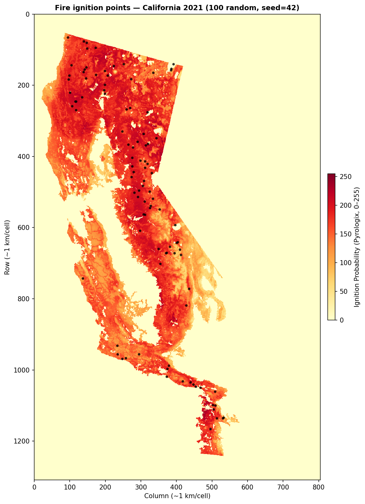

# Benchmark Report — California 2021 Greedy-Uniform Kernel

**Date:** 2026-03-16  
**Dataset:** California 2021  
**Risk map:** Pyrologix ignition probability (static, trained on 2006–2020, no data leakage for 2021)

---

## Overview

This report summarizes a placement-only benchmark on the California 2021 dataset
using the **StationMax greedy-uniform kernel** sensor-placement strategy.

Main ideas:

- Coverage from **different charging stations does not add** at a cell.
- For each cell, only the **best contributing station** is counted.
- For each station, a **risk-weighted greedy set-cover** heuristic determines
  what fraction of the zone's total risk `k = 1..Kmax` drones can cover.
- That aggregate risk fraction is then applied **uniformly** to every reachable
  cell in the station's zone, instead of being limited to the specific greedy
  paths.
- Candidate station-cell pairs are pruned to those within **one-way reach**
  `floor(max_battery_time / 2) = 3` operational cells.

This replaces the earlier cell-wise greedy-kernel StationMax formulation where
coverage was binary and restricted to cells lying on the selected greedy paths.
The greedy-uniform variant preserves the same aggregate risk-weighted coverage
within a station's zone but distributes it evenly across all reachable cells.

This report covers the three budget levels:

- **20M**
- **100M**
- **500M**

---

## Heuristic Kernel Construction

For each candidate charging station:

1. Build the local `7 × 7` operational patch corresponding to one-way reach
   `<= 3`.
2. Enumerate masked shortest paths from the station to every reachable cell in
   that patch.
3. Greedily pick up to `Kmax = 7` paths, where each drone takes the path that
   maximizes the **risk-weighted marginal gain** (sum of `static_map[cell]` over
   newly covered cells).
4. After the greedy selection, compute the **cumulative risk fraction** covered
   at each drone level: `frac(k) = sum(risk of cells covered by drones 1..k) /
   total risk in zone`.
5. Apply `frac(k)` **uniformly** to every reachable cell in the zone: all cells
   receive coverage equal to `frac(k)` when `k` drones are assigned.

This is a smoothed, risk-aware version of the earlier cell-wise greedy kernel.
It avoids the sharp binary coverage artifacts (some cells getting 1, neighbors
getting 0) while preserving the same total risk-weighted coverage per station.

Across stations, the optimizer uses a **max-over-stations** coverage model
instead of linear addition.

---

## Common Setup

| Parameter | Value |
|-----------|-------|
| Data grid | `1309 × 805` (~1 km/cell) |
| Operational grid | `261 × 161` (5 km/cell) |
| Drone speed | `600 m/min` |
| Coverage radius | `2900 m` |
| Battery | `1 h = 7` operational substeps |
| One-way reach used in pruning | `3` operational cells |
| Candidate pre-filtering | top 20% by risk / coverage potential (top 50% for 100M) |
| Solver | Gurobi |
| Time limit per run | `600 s` default; `1800 s` for the 100M run |

---

## Fire Locations

The same California 2021 fire sample/background map is used for all three
budgets. Background is the Pyrologix ignition probability map.

---

## Summary Table

| Budget | Status | Gap | Preprocess | Model creation | Solve | Allocation summary |
|--------|--------|-----|------------|----------------|-------|--------------------|
| 20M | *pending* | — | — | — | — | — |
| 100M | *pending* | — | — | — | — | — |
| 500M | *pending* | — | — | — | — | — |

*(To be filled after running the benchmarks.)*

---

## 20M Budget

### Allocation

*(To be filled after running the benchmark.)*

### Solver stats

*(To be filled after running the benchmark.)*

### Plots

---

## 100M Budget

### Allocation

*(To be filled after running the benchmark.)*

### Solver stats

*(To be filled after running the benchmark.)*

### Plots

---

## 500M Budget

### Allocation

*(To be filled after running the benchmark.)*

### Solver stats

*(To be filled after running the benchmark.)*

### Plots

---

## Conclusions

*(To be filled after running the benchmarks.)*
