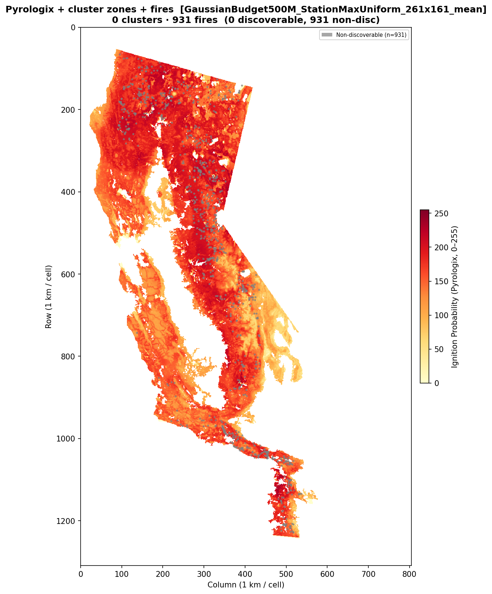
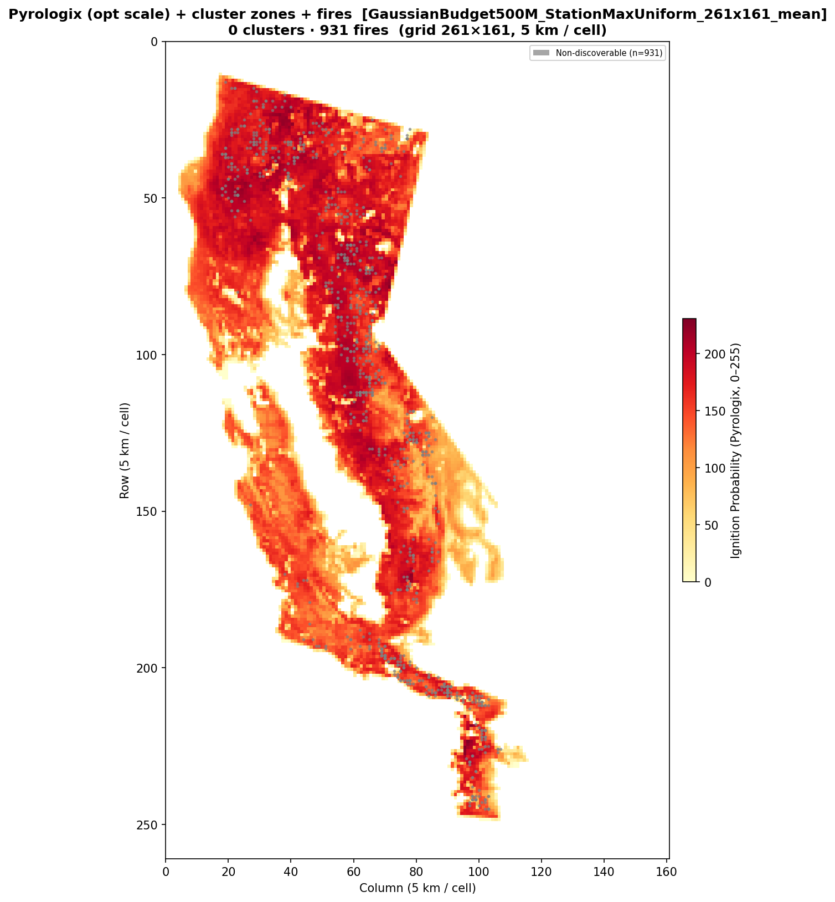

# Benchmark Report — California 2021 StationMax Uniform Kernel

**Date:** 2026-03-13  
**Dataset:** California 2021  
**Risk map:** Pyrologix ignition probability (static, trained on 2006–2020, no data leakage for 2021)

---

## Overview

This benchmark tracks the new **StationMax uniform-kernel** placement strategy.
It keeps the same high-level formulation as the greedy-kernel StationMax model:

- coverage from **different charging stations does not add** at a cell
- each cell only receives credit from its **best selected station**
- candidate station-cell pairs are restricted to the masked **one-way reachable**
  zone with `floor(max_battery_time / 2) = 3` operational cells

The difference is the **same-station multi-drone kernel**:

- for a station with `k` drones and `R` feasible masked reachable cells
- each reachable cell gets coverage `min(1, k * B / R)`
- where `B = max_battery_time = 7` operational substeps

So when all `7 × 7 = 49` cells are feasible, this reduces to `min(1, k / 7)`.

For budgets above `300M`, the objective also includes the small regularization
term `-0.1 × budget_used`, which prefers cheaper solutions once coverage is
already saturated.

---

## Common Setup

| Parameter | Value |
|-----------|-------|
| Data grid | `1309 × 805` (~1 km/cell) |
| Operational grid | `261 × 161` (5 km/cell) |
| Drone speed | `600 m/min` |
| Coverage radius | `2900 m` |
| Battery | `1 h = 7` operational substeps |
| One-way reach used in pruning | `3` operational cells |
| Candidate pre-filtering | top 20% by risk / coverage potential |
| Solver | Gurobi |
| Time limit per run | `600 s` default; `1800 s` for the final 100M rerun |

---

## Fire Locations


---

## 500M Run

The `500M` case was executed after introducing the new StationMax uniform
strategy.

Observed result:

| Metric | Value |
|--------|-------|
| Termination | `TIME_LIMIT` |
| Preprocessing | `2.37 s` |
| Model creation | `6.30 s` |
| Solve time | `604.79 s` |
| Ground sensors | 0 |
| Charging stations | 0 |
| Drones | 0 |
| Budget used | `0.00M / 500.0M` |

The solver returned objective `-0.0` with a positive bound, so this should be
interpreted as **failure to find a meaningful feasible incumbent within the
10-minute cap**, not as a valid empty optimum.

### Plots





---

## Reproduction

To rerun the full benchmark set:

```bash
bash report/benchmark_2021_stationmax_uniform_kernel/reproduce_benchmark_2021_stationmax_uniform_kernel.sh
```
