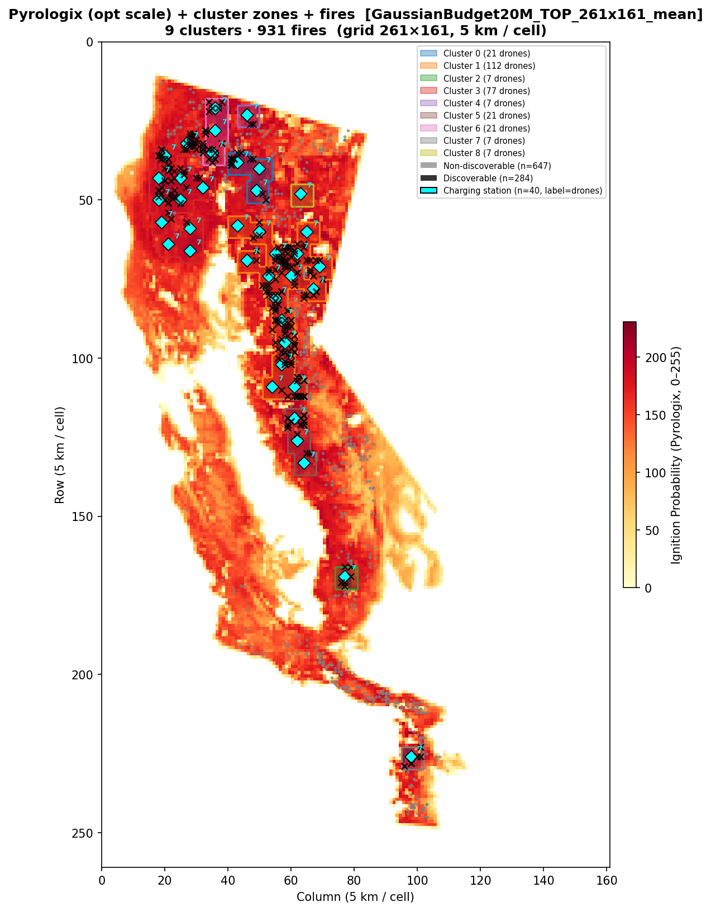
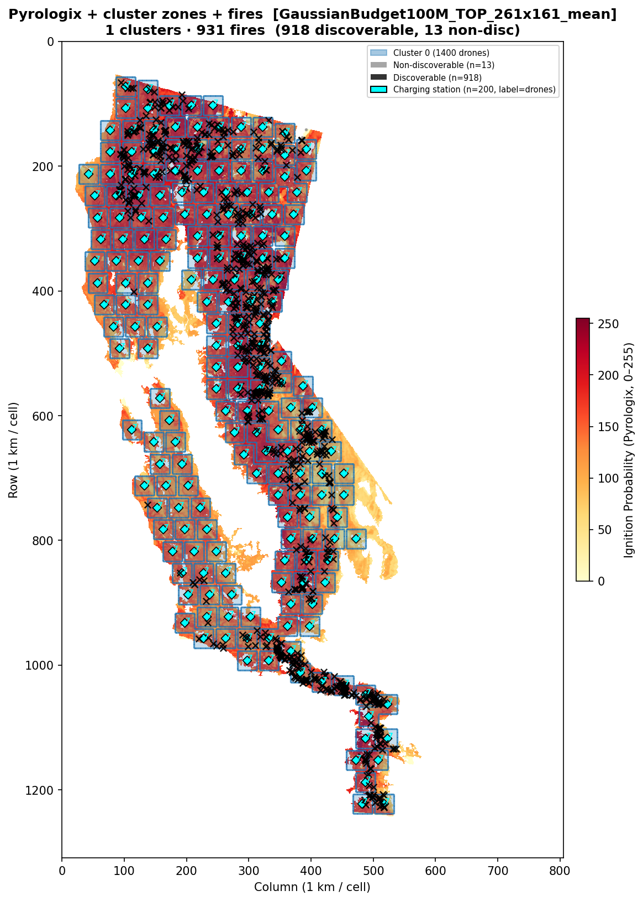
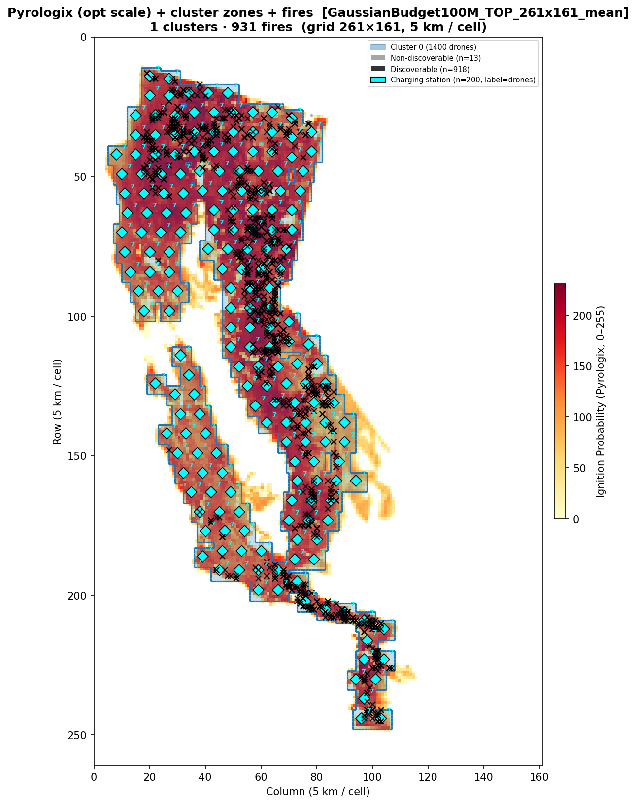
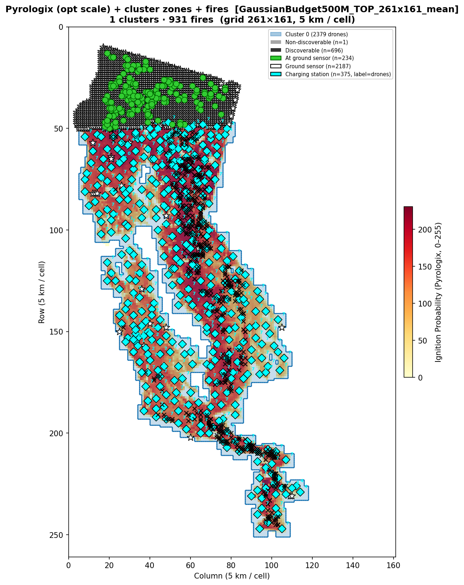

# 1. Introduction

This report presents sensor and drone placement results for the California 2021
wildfire dataset at three budget levels (\$20M, \$100M, \$500M), using a **uniform
coverage kernel** in the ILP formulation.

**Dataset:** 931 valid fires from the 2021 USFS California wildfire records,
filtered for known date/time and valid WFPI data coverage.

**Risk map:** Pyrologix Ignition Probability (static, trained on 2006–2020 data,
no data leakage for 2021).

**Script:** `run_benchmark_california2021_yearly.py`

---

# 2. Coverage Kernel

## 2.1 Problem with the previous kernel

The original placement ILP used a kernel derived from a random walk diffusion
process.  This kernel had two issues:

1. **Normalization bug:** The kernel was divided by the origin value, inflating
   weights so they summed to roughly the number of reachable cells (~49) instead
   of the patrol budget (~7).  This caused the ILP to assign unreasonably many
   drones per station (up to 58–76) to push corner cells to full coverage.

2. **Wrong model:** A random walk models independent, uncoordinated drones.  In
   practice, the routing stage (TOP / MaxCoverage) coordinates drones to cover
   non-overlapping regions, eliminating the diminishing returns of independent
   walks.

## 2.2 Uniform kernel

The corrected kernel models coordinated drone patrol:

- **Reachable zone:** $B \times B$ cells, where $B = \text{max\_battery\_time} = 7$
  (L$_\infty$ distance $\leq \lfloor B/2 \rfloor = 3$ from the station).
- **Weight per cell:** $w = 1/B = 1/7 \approx 0.143$ for all 49 reachable cells.
- **Interpretation:** Each drone visits $B = 7$ distinct cells per charge cycle.
  With coordinated routing, $B$ drones saturate the full zone
  ($B \times w \times B^2 / B^2 = 1$).
- **ILP constraint:** $\theta_i \leq \sum_j w \cdot nc_j$, \quad $\theta_i \leq 1$.

**Properties:**

- Sum of kernel weights = $B^2 / B = B = 7$ (total patrol budget of one drone).
- Drones needed to saturate one station's zone = $B = 7$.

## 2.3 Bug fixes applied

Two additional bugs were identified and fixed in the ILP formulation:

1. **Masked cells in objective (fixed):** The risk map contained non-zero values
   at masked (infeasible) cells — snow, urban, non-burnable areas. Since the
   objective summed $\text{risk}_i \cdot \theta_i$ over all $261 \times 161 =
   42,021$ cells, 57.6% of the total risk came from infeasible cells. This
   distorted the objective and wasted budget on coverage of areas where no fires
   occur.

   **Fix:** `static_map .*= mask` — zero out risk for masked cells before
   building the ILP objective.

2. **Pre-filtering too aggressive (fixed):** A hardcoded top-20\% candidate
   threshold restricted station candidates to ~2,238 cells, whose $7 \times 7$
   zones could only reach 4,279 feasible cells (38% of 11,188).  At \$100M
   this forced 181 stations into an area needing only ~88, causing 49.1%
   coverage overlap waste and only 39.6% of feasible cells covered.

   **Fix:** `candidate_percentile = 0.00` — keep all feasible cells as
   candidates (solve time remains under 20 seconds).

---

# 3. Simulation Parameters

| Parameter | Value |
|-----------|-------|
| Grid | California 2021 WFPI/Pyrologix, 1309×805 (~1 km/cell) |
| Operational grid | 261×161 (5×5 coverage blocks) |
| Drone speed | 600 m/min |
| Coverage radius | 2900 m (~2.9 km) |
| Battery (max) | 1 h = 7 operational substeps |
| Transmission range | 50 km |
| Scenarios benchmarked | 100 random fires (seed=42) from 931 valid |
| Placement strategy | `SensorPlacementMaxCoverageGaussianTimeMaskedBudget` |
| Solver | Gurobi (academic licence, 600 s time limit) |
| Candidate filtering | None (all 11,188 feasible cells) |

---

# 4. Routing Strategies

Two routing strategies are benchmarked on each placement.

**Strategy 1 — `DroneRoutingTOPMasked` (TOP)**
PSO-based Team Orienteering Problem solver.

| Parameter | Value |
|-----------|-------|
| Reevaluation step | 5 substeps |
| Optimization horizon | 10 substeps |
| Time limit per call | 60 s |
| Burn-map handling | static Pyrologix (tiled internally) |
| Visited-cell suppression | `reset_time = 2 × max_battery_time = 14` substeps |

**Strategy 2 — `DroneRoutingMaxCoverageGrowingMasked` (MaxCov)**
Greedy max-coverage routing with growing visited-cell suppression.

| Parameter | Value |
|-----------|-------|
| Reevaluation step | 5 substeps |
| Optimization horizon | 10 substeps |
| Time limit per call | 60 s |
| Burn-map handling | static Pyrologix (tiled internally) |
| Visited-cell suppression | growing (cells visited during current horizon suppressed) |

Both strategies use `burnmap_type="static"`: the single-frame Pyrologix map
`(1, 261, 161)` is tiled internally to the full horizon length.  Because the
map never changes between scenarios, all clusters share a single routing log
per strategy (`log_key="pyrologix"`).

---

# 5. Budget Comparison

## 5.1 Allocation summary

| | **\$20M** | **\$100M** | **\$500M** |
|---|---:|---:|---:|
| Ground sensors | 0 | 0 | 2187 |
| Charging stations | 40 | 200 | 375 |
| Drones | 280 | 1400 | 2379 |
| Budget used | \$20.00M | \$100.00M | \$393.90M |
| MIP gap | 0.0% | 0.01% | 0.0% |
| Solve time | 2.4 s | 19.6 s | 2.6 s |
| Clusters | 9 | 1 | 1 |

All three placements are **provably optimal** (MIP gap $\leq$ 0.01\%).

## 5.2 Drone allocation

| | **\$20M** | **\$100M** | **\$500M** |
|---|---|---|---|
| Stations with 7 drones | 40 (all) | 200 (all) | 316 |
| Stations with 0 drones | 0 | 0 | 10 |
| Stations with 1–6 drones | 0 | 0 | 49 |

At \$20M and \$100M, the ILP assigns exactly 7 drones to every station (full zone
saturation).  At \$500M, the budget saturates — not all stations need 7 drones
because the remaining cells are already covered by ground sensors.

## 5.3 Coverage efficiency (100M, before vs. after fix)

| Metric | Before (top-20\% filter) | After (no filter) |
|--------|---:|---:|
| Stations | 181 | 200 |
| Feasible cells covered | 4,436 (39.6%) | 9,541 (85.3%) |
| Overlap waste | 49.1\% | 0.4\% |
| Objective achieved | 48.1\% of max | 89.9\% of max |
| Min station spacing (L$_\infty$) | 1 | 5 |

The fix eliminates nearly all overlap waste and more than doubles the number
of feasible cells covered.

## 5.4 Key observations

**\$20M:** The optimizer allocates the full budget to stations (40) and drones
(280), with zero ground sensors.  At this budget level, drone coverage is more
cost-effective than ground sensors.  The 9 clusters target the highest-risk areas.

**\$100M:** Again, no ground sensors — all budget goes to 200 stations with
1,400 drones.  The stations space themselves at L$_\infty \geq 5$ apart,
covering 85.3\% of all feasible cells with near-zero overlap.  All stations
merge into one connected cluster.

**\$500M:** The optimizer saturates at \$393.9M — it cannot usefully spend the
remaining \$106.1M because all worthwhile placements are exhausted.  2,187
ground sensors blanket the interior of the covered zone, providing guaranteed
single-cell detection.  375 stations with 2,379 drones cover virtually all
burnable area.

\newpage

# 6. Cluster Structure

## 6.1 Cluster counts

| | **\$20M** | **\$100M** | **\$500M** |
|---|---:|---:|---:|
| Singleton clusters | variable | 0 | 0 |
| Multi-station clusters | variable | 1 | 1 |
| **Total** | **9** | **1** | **1** |

A fire scenario is **discoverable** if its ignition point (in operational space)
falls within L$_\infty$ distance $\leq 3$ of at least one charging station (one-way
reach on a single charge).

---

# 7. Placement Maps

## 7.1 \$20M Budget

### Data scale (1 km/cell)

{ width=95% }

### Operational scale (5 km/cell)

{ width=95% }

\newpage

## 7.2 \$100M Budget

### Data scale (1 km/cell)

{ width=95% }

### Operational scale (5 km/cell)

{ width=95% }

\newpage

## 7.3 \$500M Budget

### Data scale (1 km/cell)

{ width=95% }

### Operational scale (5 km/cell)

{ width=95% }

\newpage

# 8. Detection Results

Routing benchmarks (TOP and MaxCoverage strategies) are pending for all three
budget levels.  With the corrected ILP, station spacing is now $\geq 5$ cells
(at \$100M), producing well-separated clusters with exactly 7 drones per station.
This should yield efficient PSO routing with no bottleneck from oversized clusters.

---

# 9. How to Reproduce

**Sensor placement only:**

```bash
python-jl run_benchmark_california2021_yearly.py --sensor-only --budget 20
python-jl run_benchmark_california2021_yearly.py --sensor-only --budget 100
python-jl run_benchmark_california2021_yearly.py --sensor-only --budget 500
```

**Generate placement plots:**

```bash
python visualize_sensor_placement_2021.py \
  California2021Dataset/logs/sensor_alloc_GaussianBudget20M_TOP_261x161_mean.json \
  --scale both
python visualize_sensor_placement_2021.py \
  California2021Dataset/logs/sensor_alloc_GaussianBudget100M_TOP_261x161_mean.json \
  --scale both --tag _100M
python visualize_sensor_placement_2021.py \
  California2021Dataset/logs/sensor_alloc_GaussianBudget500M_TOP_261x161_mean.json \
  --scale both --tag _500M
```

**Full benchmark (placement + routing):**

```bash
python-jl run_benchmark_california2021_yearly.py --budget 20
python-jl run_benchmark_california2021_yearly.py --budget 100
python-jl run_benchmark_california2021_yearly.py --budget 500
```
