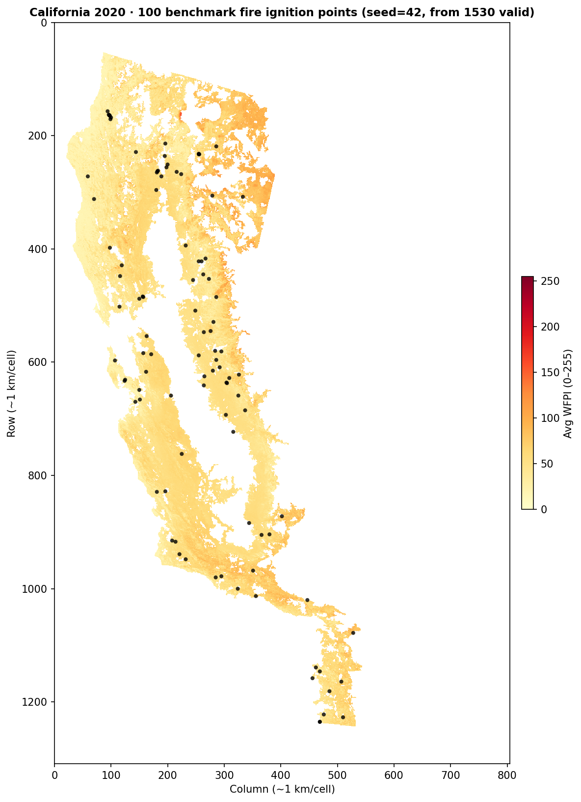
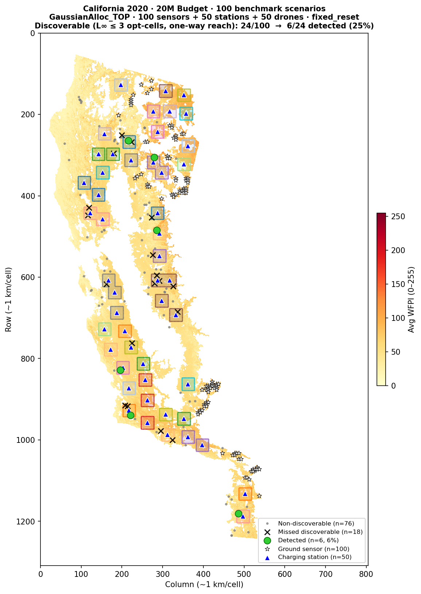

# Benchmark Report — 20M Budget, California 2020

**Date:** 2026-02-26
**Script:** `run_benchmark_california2020_yearly.py`
**Results file:** `benchmark_results_yearly_20260226_115420.csv`

---

## Setup

### Budget allocation

| Component | Count | Unit cost | Subtotal |
|-----------|------:|----------:|--------:|
| Ground sensors | 100 | 100k | 10M |
| Charging stations | 50 | 150k | 7.5M |
| Drones | 50 | 50k | 2.5M |
| **Total** | | | **20M** |

### Simulation parameters

| Parameter | Value |
|-----------|-------|
| Grid | California 2020 WFPI, 1309×805 (~1 km/cell) |
| Operational grid | 261×161 (5×5 coverage blocks) |
| Drone speed | 600 m/min |
| Coverage radius | 2900 m (~2.9 km) |
| Battery (max) | 1 h = 7 operational substeps |
| Transmission range | 50 km |
| Scenarios benchmarked | 100 random fires (seed=42) from 1530 valid |

### Sensor placement strategy

**Strategy:** `SensorPlacementMaxCoverageGaussianTimeMaskedWithAllocation`
ILP solved with Gurobi (time limit 600 s, academic licence).

- **MIP gap at termination:** 0.85%
- Preprocessing: ~1 s; model creation: ~1 s; solve: 600 s
- Pre-filtering: top 20% of feasible cells by risk/coverage potential (1757 / 8781 candidates)
- Placement saved to: `California2020Dataset/logs/sensor_alloc_GaussianAlloc_TOP_261x161_mean.json`

### Drone routing strategy

**Strategy:** `DroneRoutingTOPMasked`
PSO-based Team Orienteering Problem (TOP) solver.

| Parameter | Value |
|-----------|-------|
| Reevaluation step | 7 substeps (= max battery time) |
| Optimization horizon | 10 substeps |
| Burn-map handling | **`fixed_reset`** |
| Reset duration | 14 substeps (~2 h) |

**Reset behaviour (`fixed_reset`):** when a drone visits a cell, its burn-map value is zeroed for `reset_time_periods × reevaluation_step = 2 × 7 = 14` future substeps.
This discourages revisiting recently-patrolled cells, increasing spatial coverage diversity.

---

## Cluster structure

The 50 charging stations form **42 clusters** under L∞ distance ≤ 7 (max battery substeps).

| Type | Count |
|------|------:|
| Singleton clusters (1 station, 1 drone) | 34 |
| Two-station clusters (2 drones) | 8 |

Notable two-station clusters: `73-21_79-28`, `121-57_121-63`, `121-33_127-36`,
`88-24_91-30`, `59-28_59-35`, `63-55_68-59`, `131-59_138-66`, `198-72_202-79`.

A fire scenario is **discoverable** if its ignition point (opt-space) is within L∞ ≤ 3
of at least one charging station (`floor(max_battery / 2) = 3` — the one-way reach a
drone has while still being able to return on a single charge).

> **Note:** an earlier version of this report used L∞ ≤ 7 (full battery) as the
> discoverability threshold, which overestimated the reachable set.
> The benchmark script's `fire_cluster` function has been corrected accordingly.

---

## Benchmark fire locations

*100 fires sampled at random (seed=42) from the 1530 valid California 2020 scenarios
(those with known date, time, and offset).  Each point is a single ignition cell; no
fire spread is simulated.*

---

## Overview map

*Cluster zones show the union of each station's L∞ ≤ 3 opt-cell reachable square
(one-way drone reach on a single charge).  Two-station clusters appear as wider merged
regions.  Fire markers: green dots = detected, black × = missed but discoverable,
gray dots = outside all drone zones.*

---

## Detection results

### Scenario reachability

| Category | Count | % of total |
|----------|------:|-----------:|
| Truly discoverable (L∞ ≤ 3, one-way reach) | **24** | 24% |
| Non-discoverable (outside drone range) | 76 | 76% |
| **Total** | **100** | |

### Detection outcomes

| Outcome | Count | % of total | % of discoverable |
|---------|------:|-----------:|------------------:|
| Detected by drone | **6** | **6%** | **25%** |
| Detected by ground sensor | 0 | 0% | — |
| Undetected | 94 | 94% | — |

### Detection timing (detected fires only, n=6)

| Metric | Value |
|--------|-------|
| Mean delta_t | 0.33 half-hour steps (~10 min) |
| Min delta_t | 0 half-hour steps (immediate) |
| Max delta_t | 1 half-hour step (~30 min) |

### Drone coverage statistics (all 100 scenarios)

| Metric | Value |
|--------|-------|
| Mean total distance traveled | 1071 data-space cells |
| Mean % of map explored | 0.002% |

---

## Notes on scenario data

The California 2020 scenario files are **ignition-point-only** (shape `(3,)`: `[row, col, start_timestep]`).
Each fire is a single burning cell; fire spread is not simulated.

Implications:
- `fire_size_cells = 1` for all scenarios (no spread)
- **Ground sensor detection** requires the fire to ignite at exactly a sensor's cell — probability ≈ 100 / 1,050,000 cells ≈ 0.01%, hence 0 detections.
- **Drone detection** uses a coverage radius (~5 km, ~121 cells), so the drone needs to pass within range of the ignition cell during its patrol.

The **25% detection rate among truly discoverable fires** reflects how often the
PSO-optimized patrol route covers the actual ignition location during the 6-hour
simulation window.  All 6 detected fires have min L∞ ≤ 2, confirming they are
well within the one-way drone reach.
This serves as a baseline for comparing strategies (e.g., different budgets,
placement algorithms, or routing policies).

---

## Routing computation details

| Metric | Value |
|--------|-------|
| Unique (cluster, log_key) routings computed | 71 (used old threshold; 47 were wasted) |
| Cached replays | 0 |
| Non-discoverable scenarios skipped (old threshold) | 29 |
| Non-discoverable scenarios (corrected threshold, L∞ > 3) | 76 |
| Wall time (sensor placement, ILP) | ~10 min |
| Wall time (routing, 71 × ~70 s) | ~83 min |
| Total wall time | ~95 min |
| Julia calls per routing (168 substeps / 7) | 24 |
| Time per Julia call (post-JIT) | ~1–3 s |
