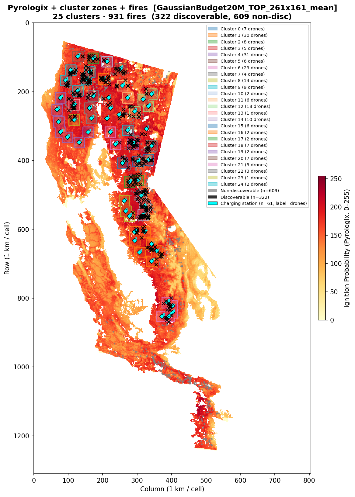
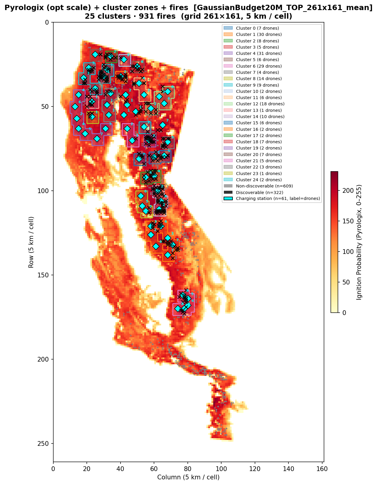
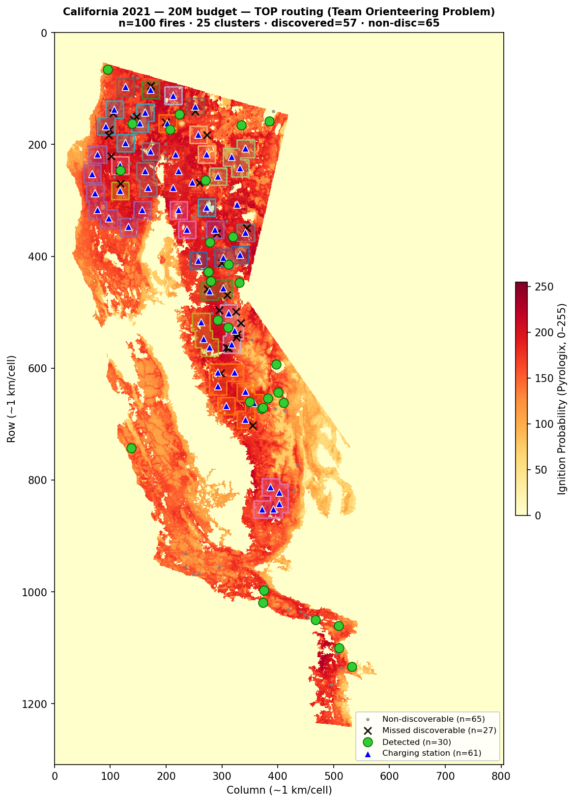
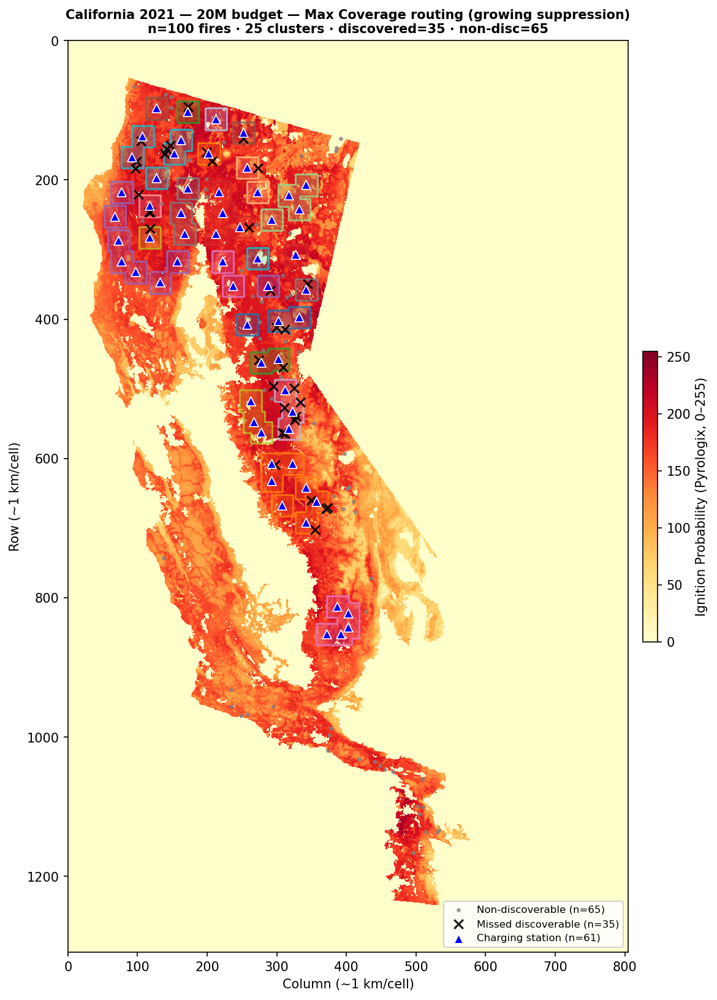

# Benchmark Report — 20M Budget, California 2021

**Date:** 2026-03-12
**Script:** `run_benchmark_california2021_yearly.py`
**Results file:** `benchmark_results_yearly_20260312_095344.csv`
**Risk map:** Pyrologix Ignition Probability (static, 2006–2020 training, no data leakage for 2021)

---

## Setup

### Budget allocation

| Component | Count | Unit cost | Subtotal |
|-----------|------:|----------:|--------:|
| Ground sensors | 0 | 100k | 0M |
| Charging stations | 61 | 150k | 9.15M |
| Drones | 217 | 50k | 10.85M |
| **Total** | | | **20M** |

The optimizer allocated the full budget to stations and drones (no ground sensors).
This is consistent with the 2020 budget-optimized result, where the ILP also chose
0 ground sensors.

### Simulation parameters

| Parameter | Value |
|-----------|-------|
| Grid | California 2021 WFPI/Pyrologix, 1309×805 (~1 km/cell) |
| Operational grid | 261×161 (5×5 coverage blocks) |
| Drone speed | 600 m/min |
| Coverage radius | 2900 m (~2.9 km) |
| Battery (max) | 1 h = 7 operational substeps |
| Transmission range | 50 km |
| Scenarios benchmarked | 100 random fires (seed=42) from 931 valid |

### Sensor placement strategy

**Strategy:** `SensorPlacementMaxCoverageGaussianTimeMaskedBudget`
ILP solved with Gurobi (time limit 600 s, academic licence).

- **MIP gap at termination:** 0.34%
- Preprocessing: ~1.5 s; model creation: ~2.8 s; solve: 601 s
- Pre-filtering: top 20% of feasible cells by risk/coverage potential (2238 / 11188 candidates)
- Placement saved to: `California2021Dataset/logs/sensor_alloc_GaussianBudget20M_TOP_261x161_mean.json`
- Risk map used: Pyrologix ignition probability (mean-pooled to operational scale)

### Drone routing strategies

Two routing strategies are benchmarked on the **same** sensor/station placement:

**Strategy 1 — `DroneRoutingTOPMasked` (TOP)**
PSO-based Team Orienteering Problem solver.

| Parameter | Value |
|-----------|-------|
| Reevaluation step | 5 substeps |
| Optimization horizon | 10 substeps |
| Time limit per call | 60 s |
| Burn-map handling | static Pyrologix (tiled internally) |
| Visited-cell suppression | `reset_time = 2 × max_battery_time = 14` substeps |

**Strategy 2 — `DroneRoutingMaxCoverageGrowingMasked` (MaxCov)**
Greedy max-coverage routing with growing visited-cell suppression.

| Parameter | Value |
|-----------|-------|
| Reevaluation step | 5 substeps |
| Optimization horizon | 10 substeps |
| Time limit per call | 60 s |
| Burn-map handling | static Pyrologix (tiled internally) |
| Visited-cell suppression | growing (cells visited during current horizon suppressed) |

Both strategies use `burnmap_type="static"`: the single-frame Pyrologix map
`(1, 261, 161)` is tiled internally to the full horizon length.  Because the map
never changes between scenarios, all clusters share a single routing log per
strategy (`log_key="pyrologix"`).

---

## Cluster structure

The 61 charging stations form **25 clusters** under L∞ distance ≤ 7 (max battery substeps).

| Type | Count |
|------|------:|
| Singleton clusters (1 station) | 12 |
| Multi-station clusters | 13 |
| Total clusters | **25** |

A fire scenario is **discoverable** if its ignition point (opt-space) is within L∞ ≤ 3
of at least one charging station (one-way reach on a single charge).

---

## Benchmark fire locations

*100 fires sampled at random (seed=42) from the 931 valid California 2021 scenarios
(those with known date, time, and offset, after excluding fires on WFPI data-missing dates).
Background: Pyrologix ignition probability.*

---

## Sensor placement maps

### Data scale (1 km/cell)

*61 charging stations overlaid on the Pyrologix ignition probability map (1309×805, 1 km/cell).
No ground sensors were selected by the optimizer.*

*25 cluster coverage zones (L∞ ≤ 3 opt-cell one-way drone reach ≈ 15 km radius)
overlaid on the Pyrologix map.  All 931 valid 2021 fire ignition points are shown.*

### Operational scale (5 km/cell)

*Same placement at the operational resolution (261×161, 5 km/cell) used for ILP
sensor placement and routing optimisation.*

*Operational-scale cluster zones and fire ignition points.  Cluster colours match
the data-scale plots above.*

---

## Overview map (routing results)

### TOP routing

*Detected fires (green ●), missed discoverable fires (black ×),
non-discoverable fires (gray ·).  Cluster zones show the one-way drone reachable area.*

### Max Coverage routing

---

## Detection results

### Scenario reachability

| Category | Count | % of total |
|----------|------:|-----------:|
| Truly discoverable (L∞ ≤ 3, one-way reach) | **57** | 57% |
| Non-discoverable (outside all drone zones) | 65 | 65% |
| **Total** | **100** | |

### Detection outcomes

#### TOP routing

| Outcome | Count | % of total | % of discoverable |
|---------|------:|-----------:|------------------:|
| Detected by drone | **30** | **30%** | **53%** |
| Detected by ground sensor | 0 | 0% | — |
| Undetected | 70 | 70% | — |

#### Max Coverage routing

| Outcome | Count | % of total | % of discoverable |
|---------|------:|-----------:|------------------:|
| Detected by drone | **19** | **20%** (19/95) | **33%** (19/57) |
| Detected by ground sensor | 0 | 0% | — |
| Undetected | 76 | 80% (76/95) | — |

*MaxCov: 95 scenarios have results; 5 scenarios did not produce a result in the CSV.*

---

## Notes on scenario data

The California 2021 scenario files contain a single ignition point and fire spread
information pre-computed from WFPI data.  Key properties:

- **Dataset size:** 931 valid fires (after filtering for known date/time, mask exclusions,
  and WFPI data-missing date exclusions — see `documentation/14_usfs_california_dataset_creation.md`)
- **Fire spread:** pre-computed into scenario files (not simulated at benchmark time)
- **Burn map for routing:** Pyrologix ignition probability — static, single frame,
  tiled 200× internally.  No WFPI yearly map is loaded at benchmark runtime.
- **Ground sensor detection:** requires fire ignition at the exact sensor cell.
  With 0 sensors placed, ground-sensor detection rate = 0%.
- **Drone detection:** fire must be within the coverage radius (~2.9 km) of a drone
  during the 3-hour simulation window.

---

## Routing computation details

| Metric | Value |
|--------|-------|
| Unique routings needed (per strategy) | 25 (one per cluster, `log_key="pyrologix"`) |
| Log duration | `MAX_ROUTING_DATA_STEPS × substeps = 24 × 7 = 168` substeps |
| Wall time (sensor placement, ILP) | ~10 min |
| Wall time (routing, TOP + MaxCov, 100 fires) | ~15 h total |
| Julia calls per routing (168 / 5) | 33–34 |
| Time per Julia call (post-JIT) | ~1–3 s |
