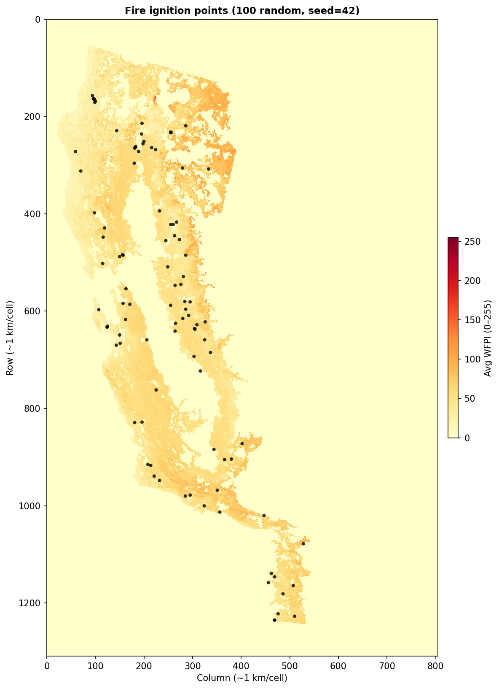

# Benchmark Report — 20M Budget-Optimized, California 2020

**Date:** *(fill when benchmark completes)*  
**Script:** `run_benchmark_california2020_yearly.py`  
**Results file:** *(e.g. `benchmark_results_yearly_YYYYMMDD_HHMMSS.csv`)*

---

## Setup

### Budget allocation (optimizer-chosen)

The optimizer chose the following allocation under a 20M budget (costs: sensor 100k, station 150k, drone 50k):

| Component | Count | Unit cost | Subtotal |
|-----------|------:|----------:|--------:|
| Ground sensors | **0** | 100k | 0 |
| Charging stations | **66** | 150k | 9.9M |
| Drones | **202** | 50k | 10.1M |
| **Total** | | | **20M** |

### Simulation parameters

| Parameter | Value |
|-----------|-------|
| Grid | California 2020 WFPI, 1309×805 (~1 km/cell) |
| Operational grid | 261×161 (5×5 coverage blocks) |
| Drone speed | 600 m/min |
| Coverage radius | 2900 m (~2.9 km) |
| Battery (max) | 1 h = 7 operational substeps |
| Transmission range | 50 km |
| Scenario duration | **6 data steps** (3 h) |
| Scenarios benchmarked | 100 random fires (seed=42) from 1530 valid |

### Sensor placement strategy

**Strategy:** `SensorPlacementMaxCoverageGaussianTimeMaskedBudget`  
ILP (Gurobi) maximizes risk-weighted coverage subject to a single budget constraint; device counts and placement are decision variables.

- **Budget:** 20M (costs in millions: sensor 0.1, station 0.15, drone 0.05)
- **MIP gap at termination:** 0.28%
- Preprocessing: ~2.4 s; model creation: ~5.3 s; solve: 600 s (time limit)
- Pre-filtering: top 20% of feasible cells by risk/coverage potential
- Placement saved to: `California2020Dataset/logs/sensor_alloc_GaussianBudget20M_TOP_261x161_mean.json`

### Drone routing strategy

**Strategy:** `DroneRoutingTOPMasked`  
PSO-based Team Orienteering Problem (TOP) solver.

| Parameter | Value |
|-----------|-------|
| Reevaluation step | 5 substeps |
| Optimization horizon | 10 substeps |
| **TOP PSO time limit** | **120 s** per solve |
| Burn-map handling | **`fixed_reset`** |
| Reset duration | 14 substeps (~2 h) |

---

## Cluster structure

The 66 charging stations form **28 clusters** under L∞ distance ≤ 7 (max battery substeps). Cluster sizes range from 1 to 7 stations and 1 to 20 drones per cluster. See overview map for spatial distribution.

A fire scenario is **discoverable** if its ignition point (opt-space) is within L∞ ≤ 3 of at least one charging station (`floor(max_battery / 2) = 3` — one-way drone reach on a single charge).

---

## Benchmark fire locations



*100 fires sampled at random (seed=42) from the 1530 valid California 2020 scenarios (those with known date, time, and offset). Each point is a single ignition cell; no fire spread is simulated.*

---

## Overview map


*Cluster zones show the union of each station's L∞ ≤ 3 opt-cell reachable square (one-way drone reach on a single charge). Fire markers: green dots = detected, black × = missed but discoverable, gray dots = outside all drone zones. Re-run `report/generate_benchmark_report_figures.py` after the benchmark to update detected/missed from the results CSV.*

---

## Detection results

*(Fill from benchmark results CSV once run completes.)*

### Scenario reachability

| Category | Count | % of total |
|----------|------:|-----------:|
| Truly discoverable (L∞ ≤ 3, one-way reach) | *TBD* | *TBD* |
| Non-discoverable (outside drone range) | *TBD* | *TBD* |
| **Total** | **100** | |

### Detection outcomes

| Outcome | Count | % of total | % of discoverable |
|---------|------:|-----------:|------------------:|
| Detected by drone | *TBD* | *TBD* | *TBD* |
| Detected by ground sensor | 0 | 0% | — |
| Undetected | *TBD* | *TBD* | — |

### Detection timing (detected fires only)

| Metric | Value |
|--------|-------|
| Mean delta_t | *TBD* half-hour steps |
| Min delta_t | *TBD* |
| Max delta_t | *TBD* |

### Drone coverage statistics (all 100 scenarios)

| Metric | Value |
|--------|-------|
| Mean total distance traveled | *TBD* data-space cells |
| Mean % of map explored | *TBD* |

---

## Notes on scenario data

The California 2020 scenario files are **ignition-point-only** (shape `(3,)`: `[row, col, start_timestep]`). Each fire is a single burning cell; fire spread is not simulated.

- **Ground sensor detection:** With 0 ground sensors in this allocation, there are no ground-sensor detections.
- **Drone detection:** Uses coverage radius (~5 km); the drone must pass within range of the ignition cell during patrol.

---

## Routing computation details

*(Fill when benchmark completes.)*

| Metric | Value |
|--------|-------|
| Unique (cluster, log_key) routings computed | *TBD* |
| Cached replays | *TBD* |
| Non-discoverable scenarios | *TBD* |
| Wall time (sensor placement) | Cached (ILP ~10 min when run) |
| Wall time (routing) | *TBD* |
| Total wall time | *TBD* |
| Julia TOP calls per routing (126 substeps / 7) | 18 |
| TOP PSO time limit per call | 120 s |

---

## After the benchmark completes

1. Note the results CSV path printed at the end (e.g. `benchmark_results_yearly_YYYYMMDD_HHMMSS.csv`).
2. Re-run the figure script so the overview map shows detected vs missed:
   ```bash
   python report/generate_benchmark_report_figures.py
   ```
3. Fill the *TBD* sections above from the CSV (detection counts, delta_t, distance, routing counts, wall times).
