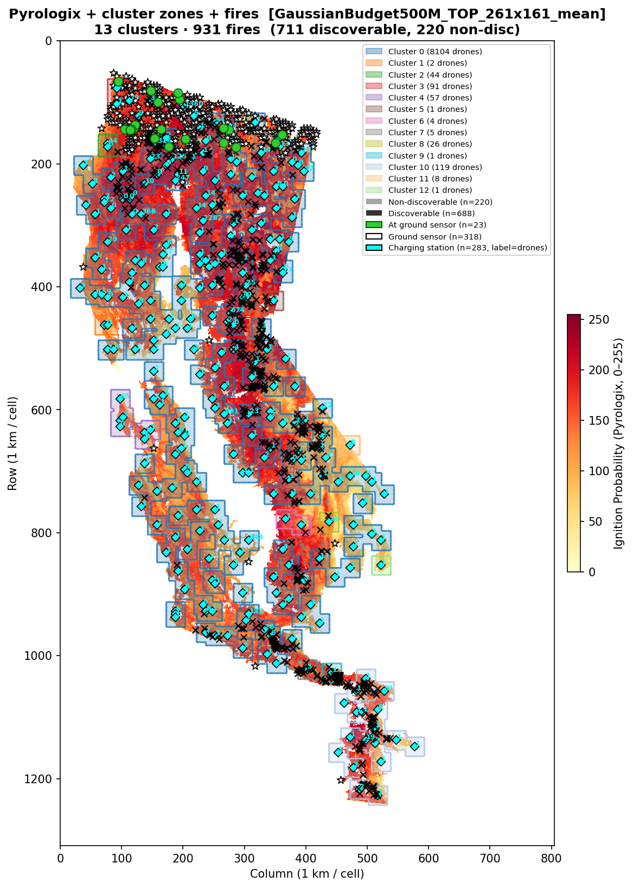
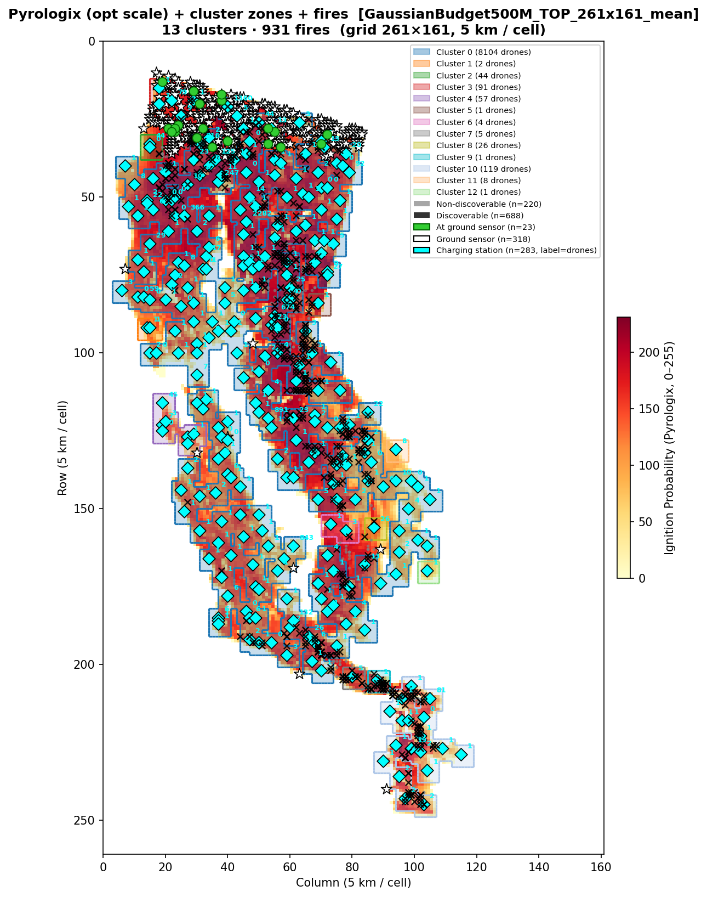

# Benchmark Report — 500M Budget, California 2021

**Date:** 2026-03-12
**Script:** `run_benchmark_california2021_yearly.py --sensor-only --budget 500`
**Results file:** *(N/A — sensor placement only; full benchmark TBD)*
**Risk map:** Pyrologix Ignition Probability (static, 2006–2020 training, no data leakage for 2021)

---

## Setup

### Budget allocation

| Component | Count | Unit cost | Subtotal |
|-----------|------:|----------:|--------:|
| Ground sensors | 318 | 100k | 31.80M |
| Charging stations | 283 | 150k | 42.45M |
| Drones | 8463 | 50k | 423.15M |
| **Total** | | | **497.4M** (of 500M) |

### Simulation parameters

| Parameter | Value |
|-----------|-------|
| Grid | California 2021 WFPI/Pyrologix, 1309×805 (~1 km/cell) |
| Operational grid | 261×161 (5×5 coverage blocks) |
| Drone speed | 600 m/min |
| Coverage radius | 2900 m (~2.9 km) |
| Battery (max) | 1 h = 7 operational substeps |
| Transmission range | 50 km |
| Scenarios benchmarked | 100 random fires (seed=42) from 931 valid |

### Sensor placement strategy

**Strategy:** `SensorPlacementMaxCoverageGaussianTimeMaskedBudget`
ILP solved with Gurobi (time limit 600 s, academic licence).

- **MIP gap at termination:** 0.0% (OPTIMAL; solve 102 s)
- Placement saved to: `California2021Dataset/logs/sensor_alloc_GaussianBudget500M_TOP_261x161_mean.json`
- Risk map used: Pyrologix ignition probability (mean-pooled to operational scale)

---

## Cluster structure

| Type | Count |
|------|------:|
| Singleton clusters (1 station) | 6 |
| Multi-station clusters | 7 |
| Total clusters | **13** |

A fire scenario is **discoverable** if its ignition point (opt-space) is within L∞ ≤ 3 of at least one charging station.

---

## Benchmark fire locations

Same 100 fires as 20M report: [benchmark_fire_locations_budget_2021.png](benchmark_fire_locations_budget_2021.png).

---

## Sensor placement maps

### Data scale (1 km/cell)

### Operational scale (5 km/cell)

---

## Detection results

*(N/A — sensor placement only. Full benchmark with routing TBD.)*
