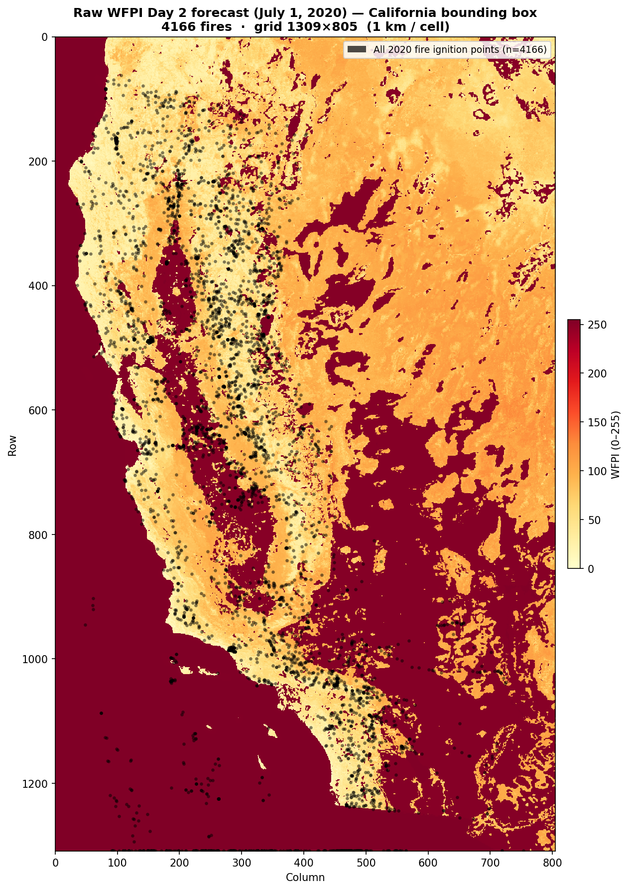
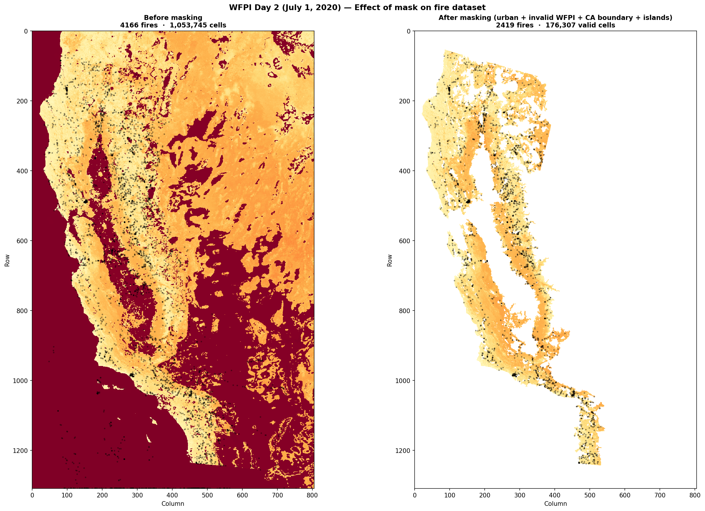
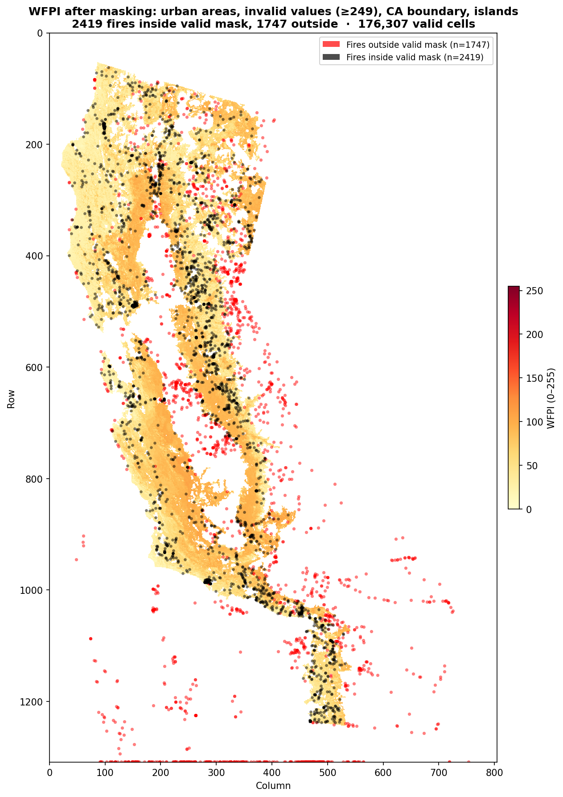
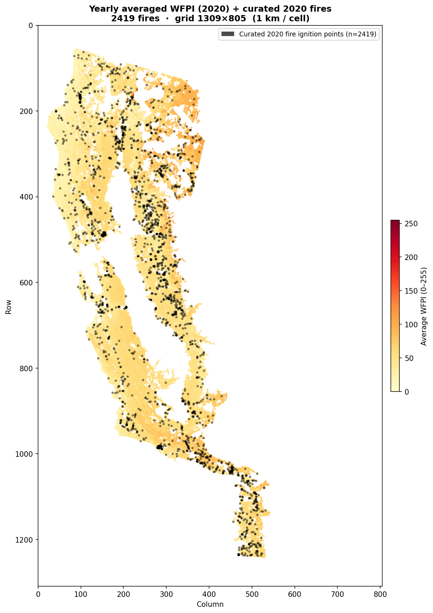
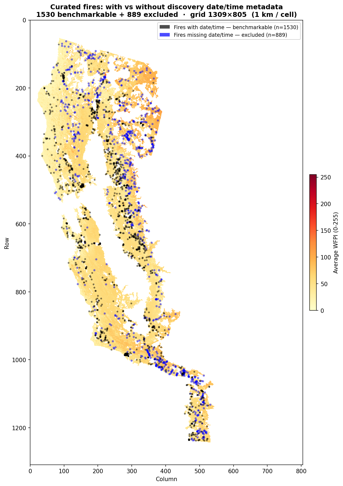
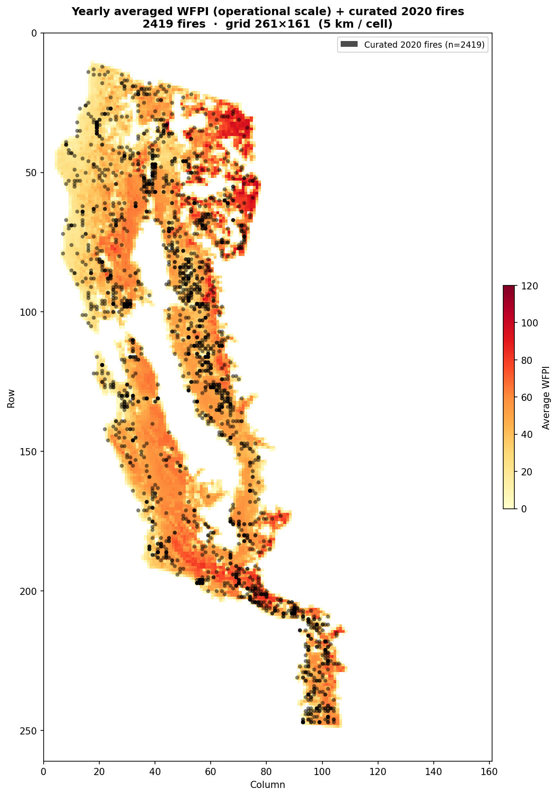
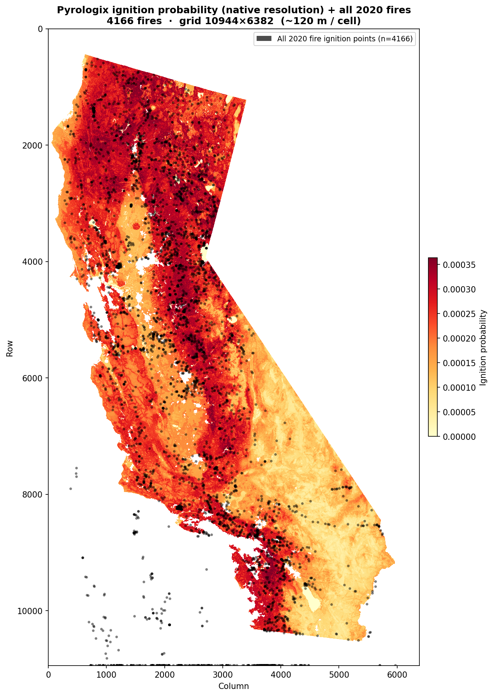
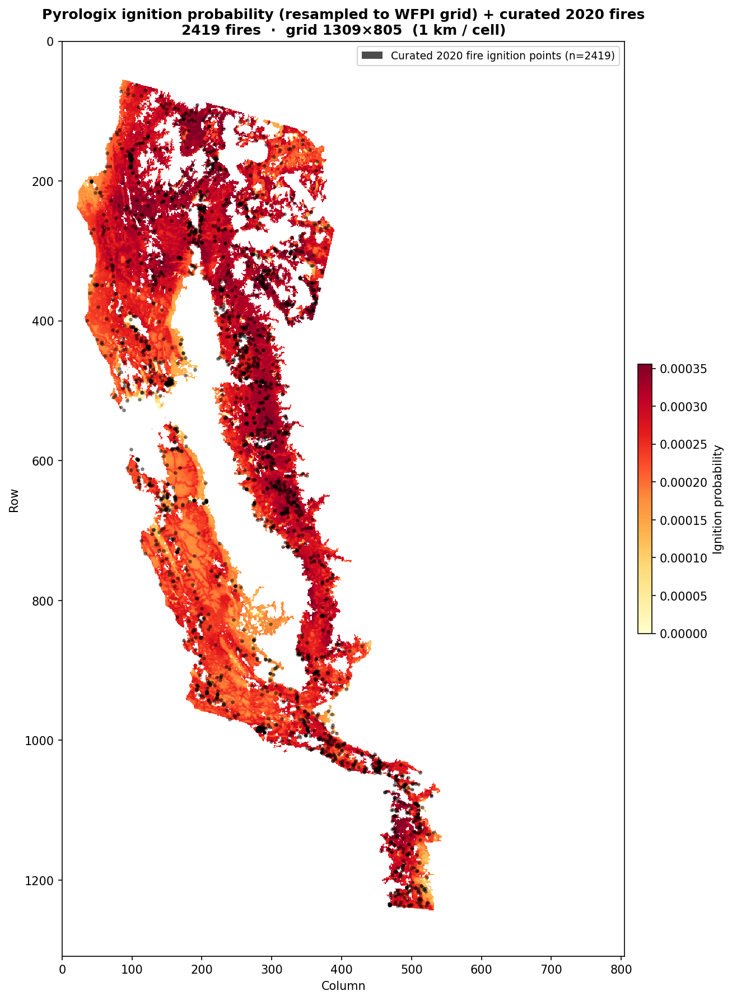
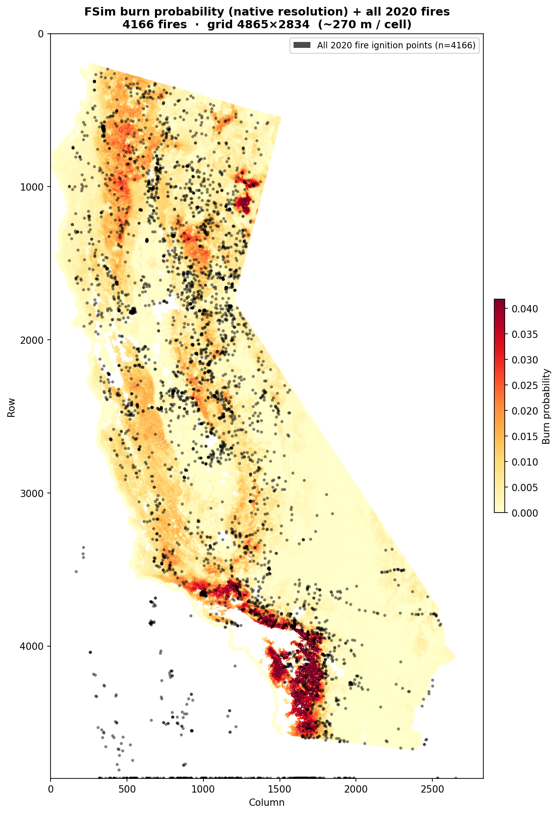
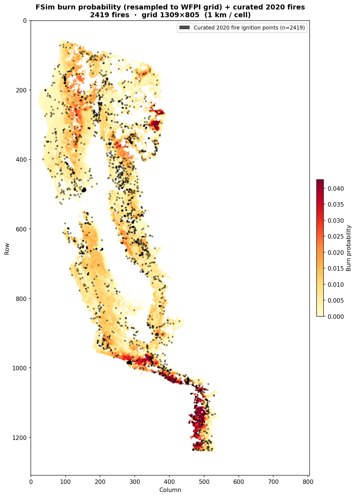

# California 2020 Wildfire Dataset: Creation and Risk Maps

This document walks through the creation of the California 2020 wildfire dataset used for drone routing optimization. We cover the WFPI-based risk maps (daily and averaged), the masking pipeline that defines our operational area, and two alternative static risk maps (Pyrologix ignition probability and FSim burn probability).

---

## 1. Source Data: WFPI Day 2 Forecast

Our primary risk data comes from the **USGS Wildland Fire Potential Index (WFPI)**, a daily raster product that estimates fire danger across the continental US. WFPI values range from 0 (no risk) to ~150 (extreme risk), with special codes 249-254 representing non-operational areas (deserts, outside US boundaries) and 255 as NoData.

We use the **Day 2 forecast** — the prediction issued one day before the target date — as the baseline risk map. This reflects the information available to decision-makers before fires are discovered.

The raw WFPI raster covers the entire continental US at **1 km resolution** (grid: 2,889 x 4,587). We crop it to a bounding box around California (with a 50 km buffer), yielding a **1,309 x 805** grid.

Below is the raw WFPI for July 1, 2020, with all 4,166 fire ignition points from the FPA FOD database (California 2020, non-prescriptive fires) overlaid. The dark red regions (WFPI >= 249) are ocean, neighboring states, and non-operational areas. Note how fires are scattered across the entire bounding box, including areas we will later mask out.

---

## 2. Masking: Defining the Operational Area

The raw WFPI crop contains large areas that are not relevant for wildland fire monitoring: the Pacific Ocean, urban areas, deserts with no vegetation, and neighboring states. We apply a multi-step mask to define the valid operational area.

### Masking Steps

The mask is built by combining four filters:

1. **California state boundary** — Only cells inside California are retained (using US Census TIGER/Line tract data). Cells in Oregon, Nevada, Arizona, and the Pacific Ocean are excluded.

2. **Invalid WFPI values** — Cells with WFPI >= 249 are masked out. These represent:
   - Values 249-254: non-operational areas (deserts with no ignition risk, areas outside US boundaries)
   - Value 255: NoData (no forecast available)

3. **Urban areas** — Cells overlapping US Census Urban Area boundaries (UAC 2020, 2,644 polygons) are excluded. Urban fires have different dynamics and are not relevant for wildland drone operations.

4. **Connected components** — After the above filters, small isolated patches (islands, disconnected pixels) are removed by keeping only the largest connected component (mainland California).

The fire scenarios are also filtered: fires that fall within urban polygons are excluded at the database level using a spatial point-in-polygon join, before creating scenario files.

### Result

| Metric | Value |
|--------|-------|
| Total cells in bounding box | 1,053,745 |
| Valid cells after masking | 176,307 (16.7%) |
| Total 2020 fires (non-prescriptive, non-urban) | 4,166 |
| Fires inside valid mask | 2,419 (58.1%) |
| Fires outside mask (boundary/invalid/islands) | 1,747 (41.9%) |

The side-by-side comparison below shows the effect of masking. On the left: the raw WFPI with all 4,166 fires. On the right: after masking, with only 2,419 fires remaining on 176,307 valid cells.

The following map shows the masked WFPI with fires color-coded: black dots are the 2,419 fires inside the valid mask, red dots are the 1,747 fires that fall outside (on ocean, urban, invalid, or island cells).

---

## 3. Yearly Averaged WFPI Map

### Averaging Process

For sensor and charging station placement (which is done once, not daily), we need a static yearly risk map. We compute this by averaging all 366 daily WFPI maps (2020 is a leap year) element-wise.

### D2 vs D1 Forecasts and the 10:00 AM Transition

USGS updates the WFPI forecasts daily at **10:00 AM local time**. Before 10:00 AM, the most recent available forecast is the **Day 2 (D2)** prediction from the previous day. After 10:00 AM, the **Day 1 (D1)** forecast for the current day becomes available.

In our simulation:
- **Before 10:00 AM** (10 hours of the 24-hour cycle): the D2 forecast is used
- **After 10:00 AM** (14 hours): the D1 forecast is used

We computed three yearly averages:
- **D2-only** average (mean of all 366 D2 maps)
- **D1-only** average (mean of all 366 D1 maps)
- **Time-weighted** average: `(10/24) * avg_D2 + (14/24) * avg_D1`

All three averages perform virtually identically for fire prediction (median ratio ~1.13x, delta ~+13 pp above background median). This is because the D1 advantage over D2 comes from per-day forecast accuracy, not from systematic differences in the yearly average.

We use the **D2 yearly average** as the default static risk map for sensor placement.

Below is the yearly averaged WFPI map with the 2,419 curated fires overlaid.

### Benchmarkable Fires: Filtering by Discovery Date/Time

Not all 2,419 curated fires can be used for benchmarking. Our drone simulation requires the exact **discovery date and time** for each fire (to select the correct daily WFPI map and compute the time offset). This metadata comes from the FPA FOD database, but is missing for some fires.

| Subset | Count |
|--------|-------|
| Curated fires (inside valid mask) | 2,419 |
| With discovery date/time (benchmarkable) | 1,530 (63.2%) |
| Missing date/time (excluded from benchmark) | 889 (36.8%) |

The map below shows the spatial distribution of both subsets. The 889 excluded fires (blue) are spatially intermixed with the 1,530 benchmarkable fires (black), confirming there is no geographic bias from this filtering step.

### Rescaling to the Operational Grid

For drone routing optimization, the 1 km data grid is rescaled to a coarser **operational grid** where each cell corresponds to the drone's coverage footprint. The rescaling parameters are:

| Parameter | Value |
|-----------|-------|
| Coverage width | 5 data cells (5 km) |
| Operational grid | 261 x 161 (= 1309/5 x 805/5) |
| Operational substeps | 7 (per data timestep) |

The rescaling uses **mean pooling**: each 5x5 block of data cells is averaged into one operational cell. The mask is pooled using **max pooling** (an operational cell is valid if *any* of its 5x5 source cells is valid). This coarser grid is what the drone routing ILP and PSO algorithms operate on.

Below is the yearly averaged WFPI at operational scale with the curated fires.

---

## 4. Alternative Static Risk Maps

In addition to the WFPI-based maps, we evaluate two static risk maps from different modeling approaches.

### 4.1 Pyrologix Ignition Probability

The Pyrologix ignition probability map is a machine-learning model trained on historical fire data (2006-2020). It estimates the annual probability of a wildfire ignition occurring in each cell, incorporating topography, climate, vegetation, and human development factors.

- **Resolution:** ~120 m/cell (grid: 10,944 x 6,382)
- **Source:** Pyrologix / USFS (DOI: 10.17605/OSF.IO/CFGH9)

> **Data leakage warning:** This map was trained on 2006-2020 fire data, which includes the 2020 fires we use for evaluation. Results may therefore be optimistically biased.

#### Native Resolution

The map below shows the Pyrologix ignition probability at its native ~120 m resolution, covering California. All 4,166 fires are overlaid (coordinates scaled from the WFPI grid).

#### Resampled to WFPI Grid

For direct comparison with WFPI, we downsample the Pyrologix map to the WFPI grid (1,309 x 805, ~1 km resolution) using bilinear interpolation with anti-aliasing. The WFPI mask is then applied, and only the 2,419 curated fires are shown.

### 4.2 FSim Burn Probability

The FSim (Fire Simulation) burn probability map estimates the annual probability that a given cell will burn, based on the USFS Large Fire Simulation system (FSim). Unlike ignition probability, this captures fire *growth* dynamics — how likely fire is to reach and burn through an area, given realistic fuel, weather, and topography conditions.

- **Resolution:** ~270 m/cell (grid: 4,865 x 2,834)
- **Source:** USFS Fire Modeling Institute (DOI: 10.2737/RDS-2016-0034-2)

> **Data leakage note:** FSim is a physics-based simulation model, not trained directly on fire occurrence records. However, its fuel and weather inputs may overlap temporally with our 2020 evaluation data — the leakage risk is unclear but lower than for Pyrologix.

The FSim map has a distinctive performance profile: it is **weak for all fires** (+5.8 pp) but **exceptionally strong for large fires** (2.21x ratio, +22.3 pp). This makes sense because FSim models fire spread potential — it identifies areas where fires can grow large, not necessarily where ignitions occur. Small fires (often human-caused, quickly contained) are not well predicted by a spread model.

Cross-year validation (2019 vs 2020) shows FSim is somewhat **less stable** than Pyrologix: the large-fire ratio drops from 2.76x in 2019 to 2.21x in 2020 (a 24.9% change), while Pyrologix varies by only 0.8% for the same metric. This suggests FSim is more sensitive to year-specific fire season characteristics.

#### Native Resolution

#### Resampled to WFPI Grid

---

## 5. Risk Map Comparison

We evaluate each risk map's ability to predict fire locations by comparing the risk values at fire ignition points against the background distribution of risk values across all valid cells. Two metrics are used:

- **Median ratio:** fire-location median / background median (higher = better)
- **Delta above median:** percentage of fires above the background median minus 50% (higher = better; a random predictor scores 0 pp)

### All 2020 Fires (n = 2,419)

| Risk Map | Median Ratio | Delta Above Median |
|----------|-------------|-------------------|
| **Ignition Prob. (Pyrologix)** | 1.21x | **+21.4 pp** |
| WFPI Day 1 avg | 1.13x | +13.4 pp |
| WFPI D2/D1 weighted avg | 1.13x | +13.3 pp |
| WFPI Day 2 avg | 1.13x | +13.1 pp |
| Burn Prob. (FSim) | 1.34x | +5.8 pp |

### Large Fires Only (>= 100 acres, n = 146)

| Risk Map | Median Ratio | Delta Above Median |
|----------|-------------|-------------------|
| **Burn Prob. (FSim)** | **2.21x** | +22.3 pp |
| **Ignition Prob. (Pyrologix)** | 1.25x | **+27.6 pp** |
| WFPI Day 1 avg | 1.09x | +16.4 pp |
| WFPI Day 2 avg | 1.10x | +16.4 pp |

### Key Takeaways

- **Ignition Probability (Pyrologix)** is the strongest overall predictor (+21.4 pp for all fires, +27.6 pp for large fires), but benefits from data leakage (trained on 2006-2020 data including 2020).
- **Burn Probability (FSim)** has the highest median ratio for large fires (**2.21x**) and strong delta (+22.3 pp), but is weak for all fires (+5.8 pp). This reflects its design: FSim models fire *spread potential*, not *ignition likelihood*, so it predicts where fires grow large rather than where they start.
- **WFPI** is the only operationally uncontaminated map (pure forecast, no training on 2020 data). Its per-day forecasts are more informative than the yearly average; the D1 forecast outperforms D2 on individual days.
- All three WFPI averages (D2, D1, weighted) perform nearly identically as static maps.

### Cross-Year Stability (2019 vs 2020)

To assess generalizability, both static maps were evaluated on 2019 fires as well:

| Risk Map | Metric | 2019 | 2020 | Change |
|----------|--------|------|------|--------|
| Ignition Prob. | Large fire ratio | 1.24x | 1.25x | +0.8% |
| Ignition Prob. | All fires delta | +19.5 pp | +21.4 pp | +1.9 pp |
| Burn Prob. | Large fire ratio | 2.76x | 2.21x | -24.9% |
| Burn Prob. | All fires delta | +9.0 pp | +5.8 pp | -3.2 pp |

Pyrologix is remarkably stable across years. FSim shows more variability, likely because its physics-based spread simulations are more sensitive to year-specific fire season conditions.

---

## 6. Daily WFPI Maps and the Fire Video

Beyond the static yearly average, the core value of WFPI lies in its **daily updates**. Each day's forecast reflects current weather conditions (wind, temperature, humidity), making it the most operationally relevant risk signal.

Our dataset contains **366 daily D2 maps** and **366 daily D1 maps** for 2020.

### Data-Resolution Video (1 km / cell)

The video below shows the daily WFPI map at data resolution (1,309 x 805) for each day of 2020, with fire ignition points appearing on their discovery date.

*Video file: [california_wfpi_fires_2020.mp4](california_wfpi_fires_2020.mp4)*

### Operational-Resolution Video (5 km / cell)

The same daily progression at the operational grid scale (261 x 161). Each frame shows both the D2 forecast (used before 10:00 AM, left) and the D1 forecast (used after 10:00 AM, right) for the same day. New fires on each day are highlighted in green; cumulative fires are shown in black.

*Video file: [11_wfpi_daily_operational.mp4](11_wfpi_daily_operational.mp4)*

---

## 7. Daily WFPI Prediction Accuracy

While the yearly averages of D1 and D2 perform nearly identically (Section 3), the **per-day** forecasts tell a very different story. The Day 1 forecast — which captures same-day weather conditions — is dramatically more informative than the Day 2 forecast issued the day before.

### Per-Day D1 vs D2: All Fires

| Metric | Day 2 (day-before) | Day 1 (same-day) | Pyrologix (static) | FSim (static) |
|--------|-------------------|-------------------|--------------------:|---------------:|
| **Median ratio** | **1.04x** | **1.24x** | **1.21x** | **1.34x** |
| **Delta above median** | **+4.7 pp** | **+15.8 pp** | **+21.4 pp** | **+5.8 pp** |

The Day 1 forecast provides a **3.4x stronger signal** than the Day 2 forecast (+15.8 pp vs +4.7 pp). This gap disappears in yearly averages because it stems from daily weather accuracy, not from systematic geographic differences between D1 and D2 maps. Note that per-day D1 substantially outperforms the static FSim map (+15.8 vs +5.8 pp) and approaches Pyrologix (+21.4 pp) — which benefits from data leakage.

### Per-Day D1 vs D2: Large Fires (>= 100 acres)

| Metric | Day 2 | Day 1 | Pyrologix (static) | FSim (static) |
|--------|-------|-------|--------------------:|---------------:|
| **Median ratio** | **1.27x** | **1.20x** | **1.25x** | **2.21x** |
| **Delta above median** | **+13.9 pp** | **+17.9 pp** | **+27.6 pp** | **+22.3 pp** |

Both forecasts improve substantially for large fires. The D2 forecast in particular jumps from +4.7 pp (all fires) to +13.9 pp (large fires), suggesting that large fires occur preferentially in areas with structurally high WFPI — areas that even the day-before forecast can identify. For large fires, FSim becomes the strongest non-contaminated predictor by ratio (**2.21x**), consistent with its design as a fire-spread model that identifies where fires can grow large.

### Daily vs Static: Overall Ranking

Combining the per-day results with the static map comparison from Section 5:

| Risk Map | Type | Delta (All Fires) | Delta (Large Fires) |
|----------|------|-------------------|---------------------|
| Ignition Prob. (Pyrologix) | Static | +21.4 pp | +27.6 pp |
| **WFPI Day 1 (per-day)** | **Daily** | **+15.8 pp** | **+17.9 pp** |
| WFPI Day 2 (per-day) | Daily | +4.7 pp | +13.9 pp |
| Burn Prob. (FSim) | Static | +5.8 pp | +22.3 pp |
| WFPI D2 yearly avg | Static | +13.1 pp | +16.4 pp |

The **daily D1 forecast** is the strongest operationally uncontaminated predictor. Pyrologix scores higher but suffers from data leakage (trained on 2006-2020 data including the 2020 fires being evaluated). For real-world deployment, the D1 forecast is the most reliable daily risk signal available.

Note also that the **D2 yearly average** (+13.1 pp) substantially outperforms the **D2 per-day** forecast (+4.7 pp). This is because the average smooths out daily noise and captures the stable geographic patterns of fire risk — even a weak daily forecast averages into a useful static map.

---

## 8. Dataset Summary

| Item | Value |
|------|-------|
| **Study area** | California, USA |
| **Year** | 2020 |
| **Data grid resolution** | 1 km / cell (WFPI native) |
| **Data grid size** | 1,309 x 805 (after CA crop) |
| **Valid data cells** | 176,307 (16.7% of grid) |
| **Operational grid resolution** | 5 km / cell (5x5 mean pooling) |
| **Operational grid size** | 261 x 161 |
| **Valid operational cells** | 8,781 |
| **Operational substeps** | 7 (per data timestep) |
| **Fire source** | FPA FOD (Fire Program Analysis, Fire Occurrence Database) |
| **Total fires (non-prescriptive, non-urban)** | 4,166 |
| **Fires inside valid mask** | 2,419 |
| **Fires with discovery date+time (benchmarkable)** | 1,530 |
| **Daily WFPI maps (D2)** | 366 (full year) |
| **Daily WFPI maps (D1)** | 366 (full year) |
| **Mask filters** | CA boundary, WFPI >= 249, urban areas (UAC 2020), connected components |
| **Alternative risk maps** | Pyrologix ignition prob. (~120 m), FSim burn prob. (~270 m) |
