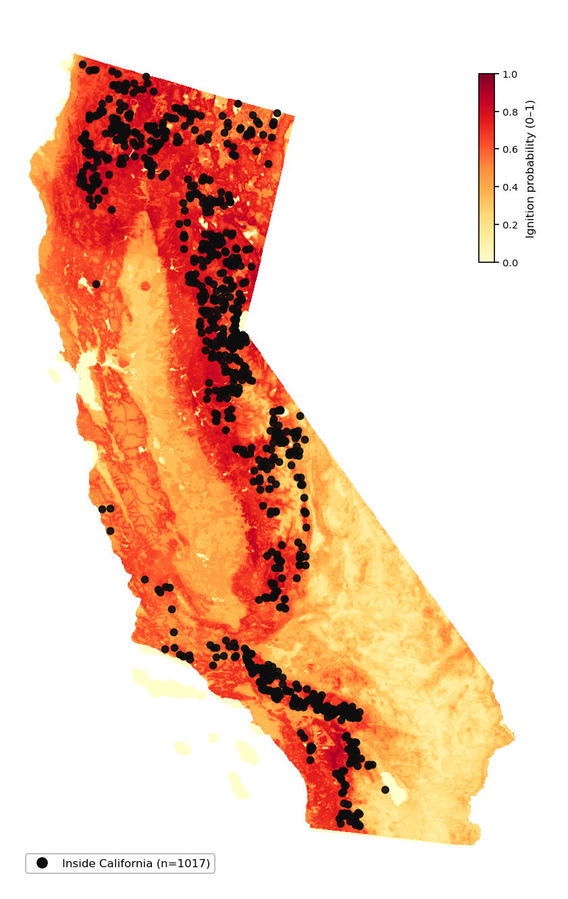
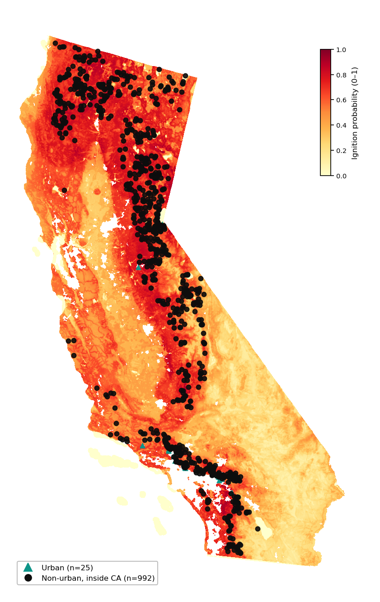
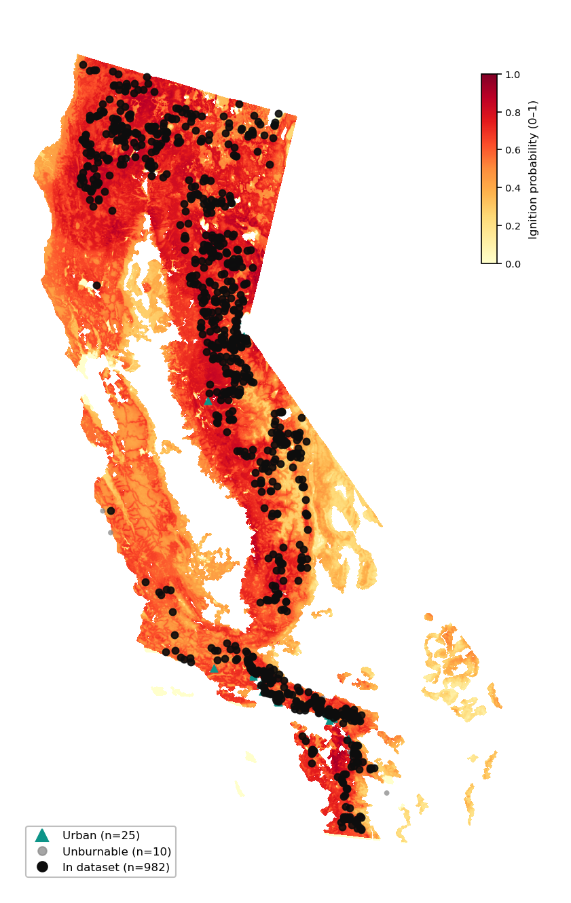

# California 2021 Benchmark Dataset: Construction (Appendix)

This appendix describes how we built the **California 2021** wildfire ignition dataset and the **operational domain mask** used with the Pyrologix static risk map in benchmarks such as [`benchmark_2021_greedy_kernel/benchmark_2021_greedy_kernel.md`](../benchmark_2021_greedy_kernel/benchmark_2021_greedy_kernel.md). Figures are generated by:

`conda run -n wf python code/dataset_creation/nature_dataset_creation/generate_paper_2021_dataset_explainer.py`

(Plots use `plot_pyrologix_valid_region` and `plot_pyrologix_fire_categories` in [`code/displays.py`](../../code/displays.py).) Auto-updated cell and fire counts are in [`counts.md`](counts.md).

---

## 1. Risk map and study grid

**Pyrologix** ignition probability, resampled to the same **1 km** grid as the USGS WFPI product (**1309 × 805** cells, Lambert Azimuthal Equal-Area, California bounding box with 50 km buffer), is stored in `California2021Dataset/static_risk_pyrologix.npy`. The model was trained on **2006–2020** data, so it is **out-of-sample for 2021** ignitions (no training leakage on evaluation fires). Values are rescaled to **0–255** for compatibility with placement code.

---

## 2. Mask construction (cumulative steps)

The **final mask** copied into `California2021Dataset/mask.npy` is `California2020Dataset/mask_union_burnable_no_snow_excluded_day1.npy`: it is **independent of 2021** and defines where ignitions and routing are valid. We visualize the same logic **cumulatively** on a Pyrologix background (invalid cells are **white** in the figures). **Figures use a linear scale 0–1** (stored values 0–255 divided by 255); the color scale is inset at the upper right of each map. **Dataset ignitions** (black markers) are overlaid on every map, including the four mask steps below. **Fire-category legends** match the all-categories figure: **urban** (teal triangles), **Unburnable** (grey disks, once the WFPI rule applies), and **in dataset** (black disks). Ignitions outside the California polygon are **not** drawn on the maps (they remain in the §3 count table). For the first two mask panels (before the WFPI union-burnable constraint), the legend **omits** the Unburnable row; those ignitions are still plotted as ordinary black dots (see figure captions).

| Step | Description |
|------|-------------|
| **(1)** | **California land:** rasterized US Census tract boundary (state polygon), 50 km buffer on the WFPI crop. |
| **(2)** | **Exclude urban (eroded):** cells overlapping **US Census Urban Areas 2020** (`tl_2025_us_uac20`), with the urban raster **eroded by 1 pixel** so fires on the boundary of urban areas are not excluded. |
| **(3)** | **Exclude permanently non-burnable (WFPI):** using **all 366 daily WFPI Day 1 maps for 2020**, a cell is kept if on **at least one day** it has value **&lt; 249** or **= 250** (snow); cells that are **always** in **249** or **251–255** are removed (“union burnable”, snow **not** treated as invalid). |
| **(4)** | **Connected components ≥ 9×9 km² + 1-pixel dilation:** instead of keeping only the largest connected component, all components with area **≥ 81 cells** (~9×9 km² at ~1 km resolution) are retained. The resulting mask is then **dilated by 1 pixel** to absorb boundary fires that fall just outside the mask edge. |

### Valid cells after each step

| Step | Valid cells |
|------|-------------|
| (1) California boundary | 426,469 |
| (2) Excluding urban (eroded) | 406,688 |
| (3) Excluding always WFPI-invalid | 272,168 |
| (4) Components ≥ 9×9 km² + 1 px dilation | 283,790 |

---

## 3. Fire records: USFS ignitions (2021)

**Source:** USFS ignition-point extract `USFS_ignition_points.csv` (wildfire records with discovery location and time).

**Stage 1 — tabular and geographic filters**

- Year **2021**, California identifiers (`UNIQFIREID` prefix `2021-CA`), **wildfire** only (`FIRETYPECATEGORY == 'WF'`).
- Valid **discovery datetime**, **latitude/longitude**.
- Point inside **California** state polygon (Census tracts, dissolved).
- **Not** inside an **urban** polygon (same UAC layer as the mask).

**Stage 2 — grid and mask**

- Project each point to WFPI grid indices **(row, col)**.
- Discard if out of bounds or if **`mask[row, col] != 1`**.

**2021-specific exclusion**

- For **27** calendar days, no native **2021 WFPI Day 2** archive zip is available. Ignitions whose **discovery date** falls on one of those days are **excluded** so every retained scenario can be paired with real or nearest-neighbour WFPI files (see `create_california_2021_dataset.py`). They appear as a separate category on the overview figure.

### Fire counts

| Category | Count |
|----------|-------|
| Raw CA wildfires (CSV filters) | 1,086 |
| Outside CA boundary | 13 |
| Urban | 25 |
| Non-urban, off grid or mask | 10 |
| Excluded — missing 2021 WFPI zip date | 56 |
| **In dataset (filter pipeline)** | **982** |
| Scenario files `*.npy` on disk | 981 |

The spatial filter yields **982** ignitions; the repository currently contains **981** per-scenario files under `California2021Dataset/scenarii/` (see `dataset_summary.json`). Benchmark code draws only from scenarios that have **`offset_` / `date_` / `time_`** entries in `config_california_2021.json`.

---

## 4. Fire figures (Pyrologix, final mask)

**All categories** — ignitions from the stage-1 cohort shown by filter outcome: urban (teal), **Unburnable** (grey), and **in dataset** (outside-CA points are omitted from the figure). (Fires excluded only because of missing 2021 WFPI zip dates are omitted from this map; their count is in the table in §3.)

**Dataset only** — ignitions that pass all filters (**982** in the pipeline; coordinates are those used for mask checks).

**Benchmark subsample** — **100** scenarios chosen with **`numpy.random.default_rng(42)`** without replacement from the list of scenario files that have complete config metadata, matching **`run_benchmark_california2021_yearly.py`** (`BENCHMARK_SUBSET_SIZE`, `RANDOM_SEED`).

---

## 5. Related documentation

- USFS pipeline and mask logic: [`documentation/14_usfs_california_dataset_creation.md`](../../documentation/14_usfs_california_dataset_creation.md)
- 2021 dataset build script: [`code/dataset_creation/nature_dataset_creation/create_california_2021_dataset.py`](../../code/dataset_creation/nature_dataset_creation/create_california_2021_dataset.py)
- Mask build: [`code/dataset_creation/nature_dataset_creation/build_mask_union_burnable_day1.py`](../../code/dataset_creation/nature_dataset_creation/build_mask_union_burnable_day1.py)
