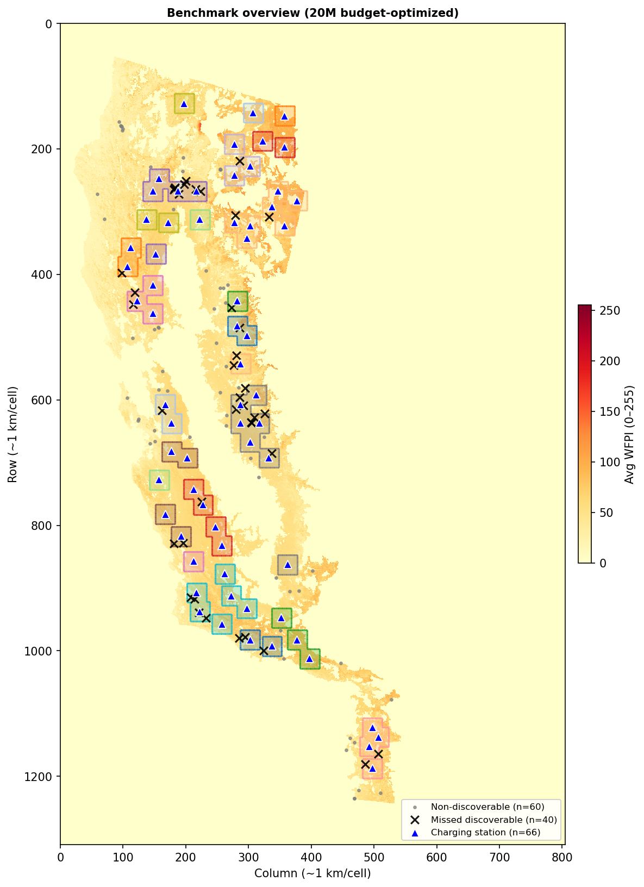
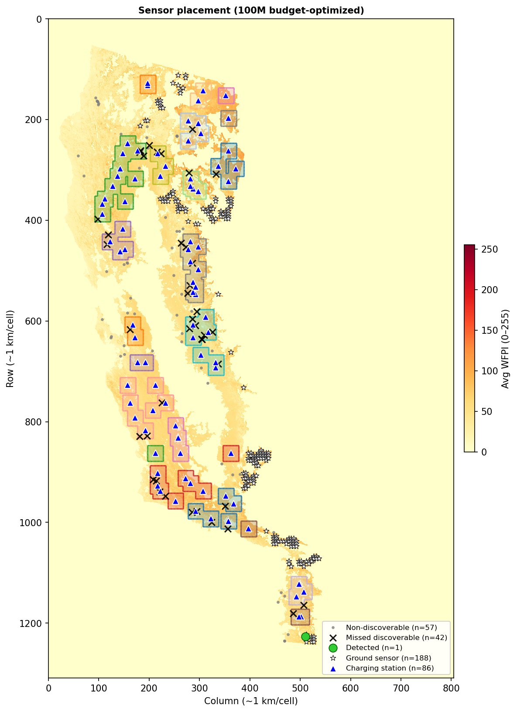
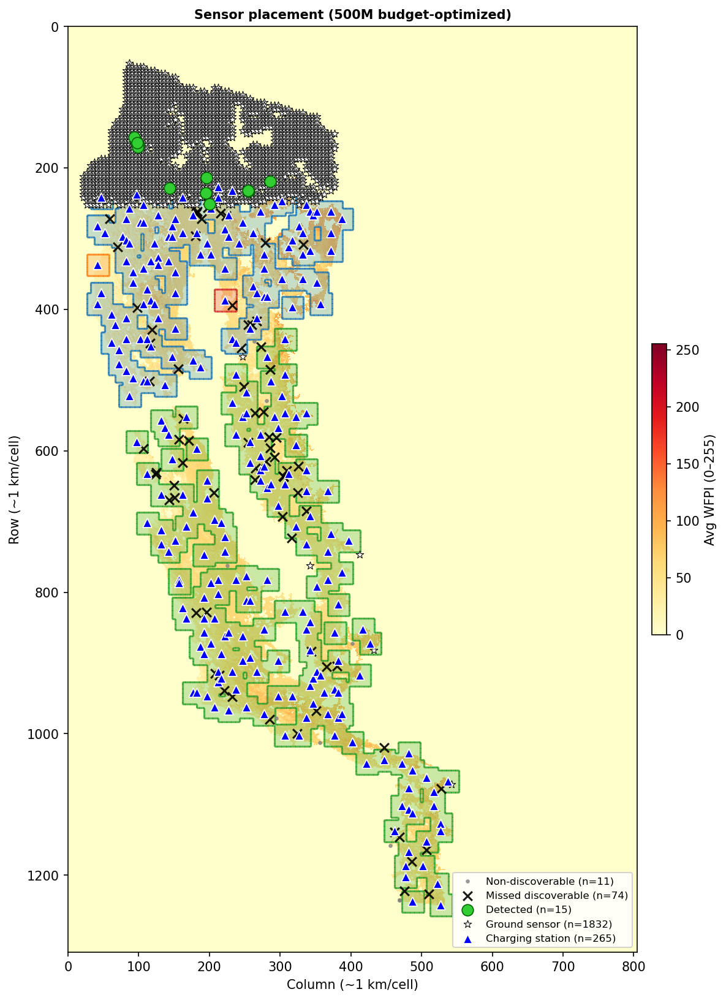
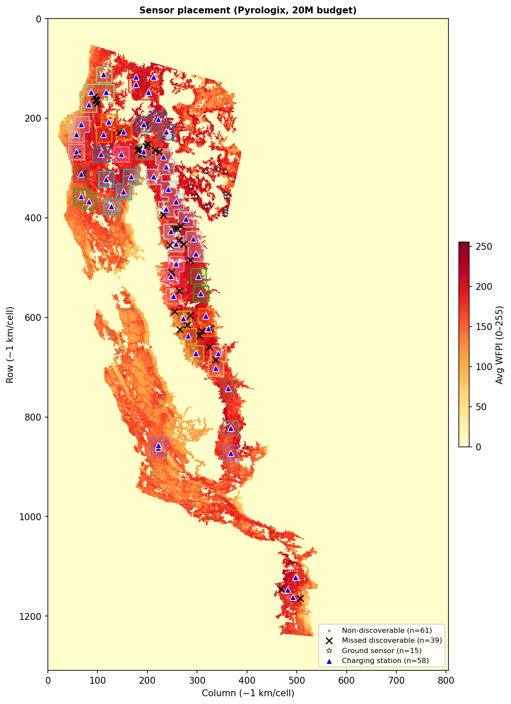
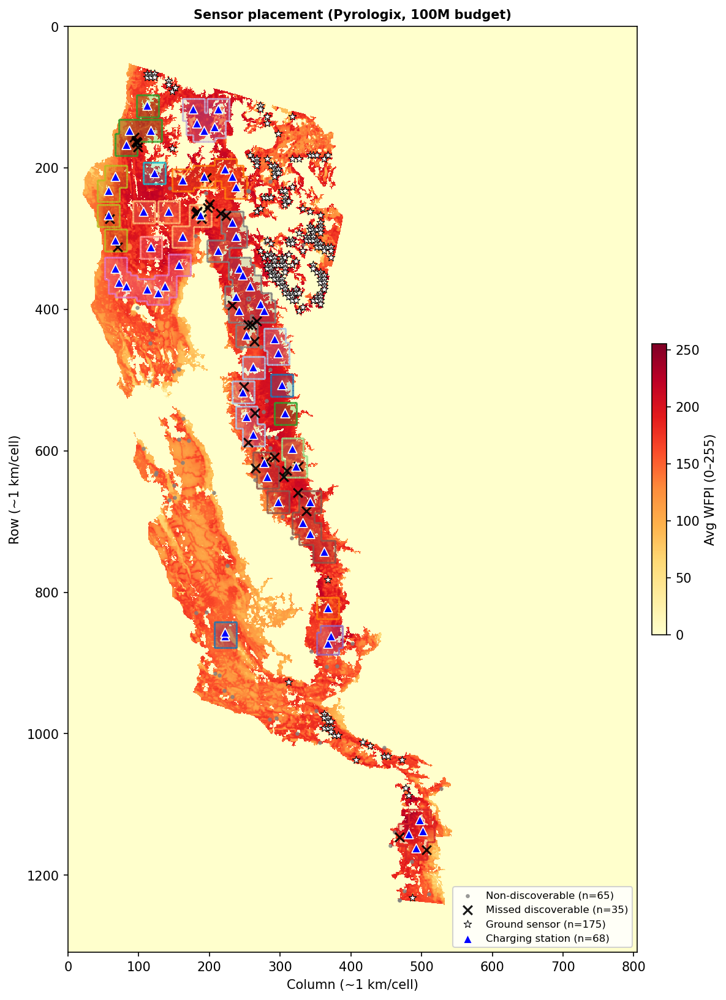
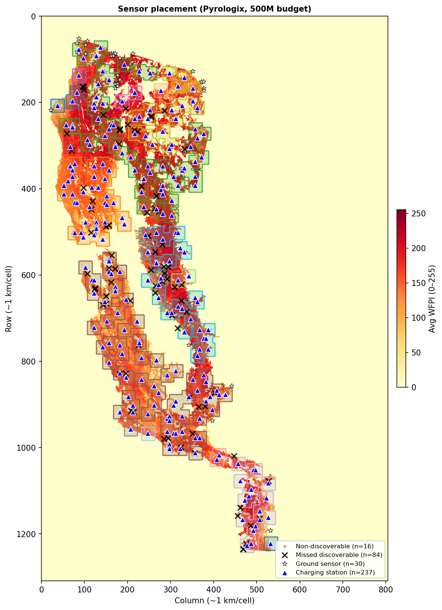
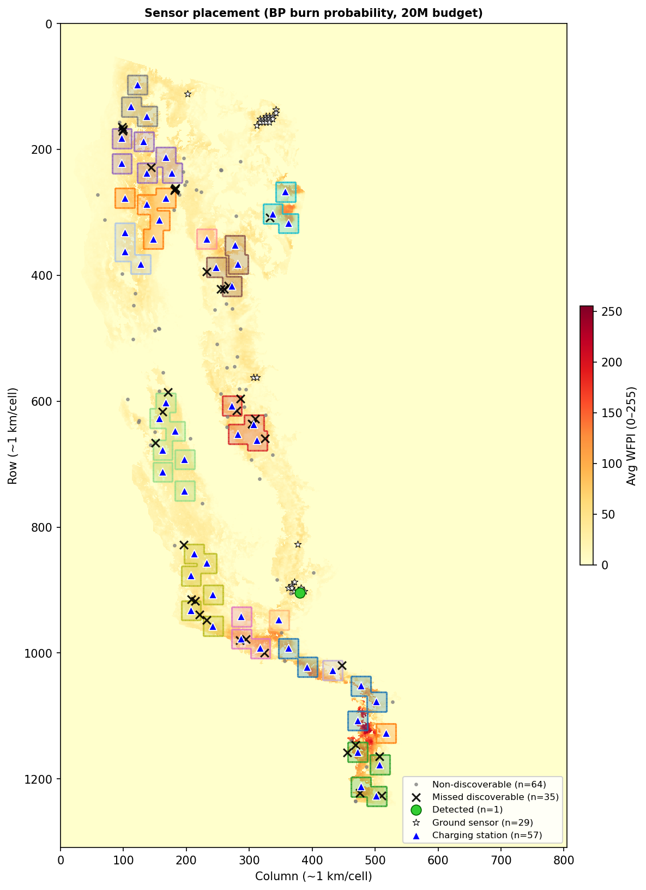
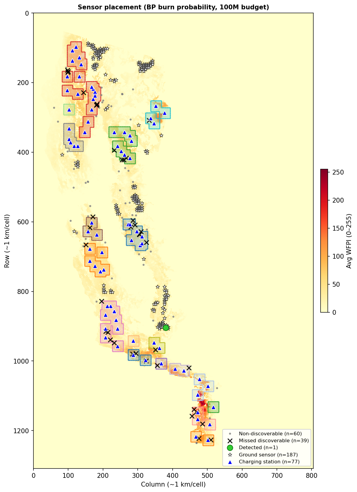
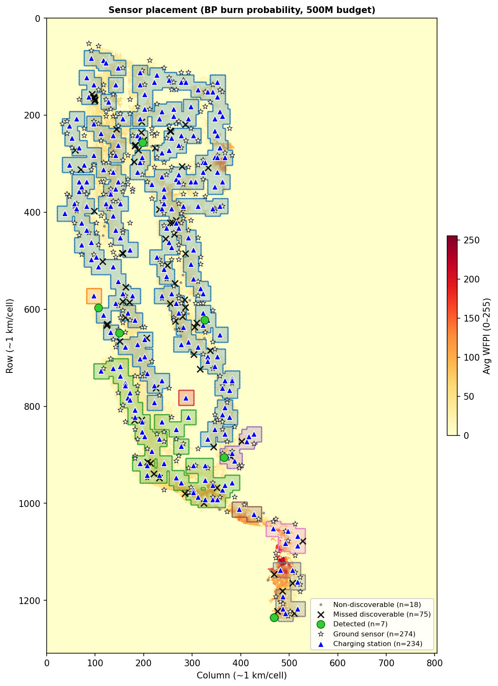

# Sensor Placement Results — WFPI vs Pyrologix vs BP (burn probability)

Budget-optimized sensor placement on the California 2020 grid (261×161 operational cells) under three risk maps: **WFPI (mean)**, **Pyrologix ignition probability**, and **BP (FSim burn probability)**. Same costs: sensor 100k, station 150k, drone 50k. Gurobi time limit: 600 s (10 min).

---

## Risk maps

| Map | Description |
|-----|-------------|
| **WFPI (mean)** | Time-averaged WFPI burn probability, pooled to operational scale (5×5 blocks). Cache: `static_risk_wfpi_avg_mean_rescaled_261x161_7substeps.npy`. |
| **Pyrologix** | Wildfire ignition probability (ML, 2006–2020), resampled to WFPI grid (1309×805) then pooled. Cache: `static_risk_pyrologix_resampled_mean_rescaled_261x161_7substeps.npy`. |
| **BP (burn prob)** | FSim burn probability (`California2020Dataset_BurnProb/static_risk_burn_prob.npy`, native 4865×2834), resampled to WFPI grid (1309×805) and cached as `California2020Dataset/static_risk_burn_prob_resampled.npy`, then pooled. Cache: `static_risk_burn_prob_resampled_mean_rescaled_261x161_7substeps.npy`. |

---

## Allocations by budget and risk map

### 20M budget

| | WFPI (mean) | Pyrologix | BP (burn prob) |
|---|-------------|-----------|----------------|
| **Ground sensors** | 0 | **15** | **29** |
| **Charging stations** | 66 | **58** | **57** |
| **Drones** | 202 | **196** | **171** |
| **MIP gap** | 0.28% | **0.41%** (time limit) | **0.11%** (time limit) |
| **Placement map** | [benchmark_fire_map_budget.png](benchmark_fire_map_budget.png) | [benchmark_fire_map_pyrologix_20M.png](benchmark_fire_map_pyrologix_20M.png) | [benchmark_fire_map_burnprob_20M.png](benchmark_fire_map_burnprob_20M.png) |

### 100M budget

| | WFPI (mean) | Pyrologix | BP (burn prob) |
|---|-------------|-----------|----------------|
| **Ground sensors** | 188 | **175** | **187** |
| **Charging stations** | 86 | **68** | **77** |
| **Drones** | 1366 | **1446** | **1395** |
| **MIP gap** | 0.01% | **0.01%** (time limit) | **0.1%** (time limit) |
| **Placement map** | [benchmark_fire_map_budget_100M.png](benchmark_fire_map_budget_100M.png) | [benchmark_fire_map_pyrologix_100M.png](benchmark_fire_map_pyrologix_100M.png) | [benchmark_fire_map_burnprob_100M.png](benchmark_fire_map_burnprob_100M.png) |

### 500M budget

| | WFPI (mean) | Pyrologix | BP (burn prob) |
|---|-------------|-----------|----------------|
| **Ground sensors** | 1832 | **30** | **274** |
| **Charging stations** | 265 | **237** | **234** |
| **Drones** | 2412 | **9130** | **8747** |
| **MIP gap** | 0.0% | **0.0%** (optimal) | **0.0%** (optimal) |
| **Placement map** | [benchmark_fire_map_budget_500M.png](benchmark_fire_map_budget_500M.png) | [benchmark_fire_map_pyrologix_500M.png](benchmark_fire_map_pyrologix_500M.png) | [benchmark_fire_map_burnprob_500M.png](benchmark_fire_map_burnprob_500M.png) |

*Pyrologix 500M: budget used 495.05M (candidate limit); solved to optimality in ~8 s.*

---

## Discoverable fires (WFPI vs Pyrologix)

A fire is **discoverable** if either (1) its ignition cell is within L∞ ≤ 3 of a charging station (one-way drone reach), or (2) its ignition cell is at a ground sensor (detected by ground sensor). The same **100 benchmark fires** (seed=42) are used for all placements.

| Budget | WFPI (mean) discoverable | Pyrologix discoverable | Non-discoverable (WFPI) | Non-discoverable (Pyrologix) |
|--------|---------------------------|-------------------------|--------------------------|------------------------------|
| **20M**  | **40** / 100 | **39** / 100 | 60 | 61 |
| **100M** | **43** / 100 | **35** / 100 | 57 | 65 |
| **500M** | **89** / 100 | **84** / 100 | 11 | 16 |

- At **20M**, both maps give similar coverage (40 vs 39); WFPI has no ground sensors, Pyrologix has 15 (no fire in the 100 lies on a Pyrologix sensor cell at 20M).
- At **100M**, WFPI has 188 ground sensors—one of the 100 fires lies on a sensor cell, so discoverable is 43 (42 by drone + 1 by sensor). Pyrologix discoverable stays 35.
- At **500M**, WFPI’s many ground sensors (1832) add 12 fires that lie on sensor cells (77 drone-reachable + 12 = 89). Pyrologix has fewer sensors (30) and still reaches 84 by drone.

The placement maps below show discoverable vs non-discoverable for each case: **green** = detected (e.g. at ground sensor), **black ×** = discoverable but not yet detected, **gray** = non-discoverable.

### WFPI placement maps (discoverable zones)

| Budget | Map |
|--------|-----|
| 20M  | [](benchmark_fire_map_budget.png) |
| 100M | [](benchmark_fire_map_budget_100M.png) |
| 500M | [](benchmark_fire_map_budget_500M.png) |

### Pyrologix placement maps (discoverable zones)

| Budget | Map |
|--------|-----|
| 20M  | [](benchmark_fire_map_pyrologix_20M.png) |
| 100M | [](benchmark_fire_map_pyrologix_100M.png) |
| 500M | [](benchmark_fire_map_pyrologix_500M.png) |

### BP (burn probability) placement maps (discoverable zones)

| Budget | Map |
|--------|-----|
| 20M  | [](benchmark_fire_map_burnprob_20M.png) |
| 100M | [](benchmark_fire_map_burnprob_100M.png) |
| 500M | [](benchmark_fire_map_burnprob_500M.png) |

*To recompute counts: `python report/count_discoverable.py`*

---

## Summary

- **Strategy:** `SensorPlacementMaxCoverageGaussianTimeMaskedBudget` (single budget constraint; device counts and locations are decision variables).
- **WFPI:** At 20M the optimizer uses only stations and drones (0 ground sensors). At 100M and 500M it adds many ground sensors and more stations/drones; MIP gap reaches 0% at 500M within the time limit.
- **Pyrologix:** 20M and 100M hit the 10 min time limit (gaps 0.41% and 0.01%); 500M solved to optimality in ~8 s (candidate set smaller than budget). Placement figures generated for 20M, 100M, 500M.
- **BP (burn probability):** Same pipeline as Pyrologix but using FSim burn probability resampled to the WFPI grid. Run the BP script to compute placements for 20M, 100M, 500M; after each budget the figure script is invoked to produce `benchmark_fire_map_burnprob_{20,100,500}M.png`. Fill allocation and MIP gap from the BP run logs into the tables above.

---

## How to run

**WFPI (single budget):**
```bash
python-jl run_benchmark_california2020_yearly.py --sensor-only --budget 20   # or 100, 500
```

**Pyrologix (20M, 100M, 500M in one go):**
```bash
python-jl run_benchmark_california2020_pyrologix.py --sensor-only
```
Optional: `--budget 20,100,500` and `--time-limit 600`.

**BP (burn probability; 20M, 100M, 500M; plot after each budget):**
```bash
python-jl run_benchmark_california2020_burnprob.py --sensor-only
```
Optional: `--budget 20,100,500` and `--time-limit 600`. Creates `California2020Dataset/static_risk_burn_prob_resampled.npy` and `logs/sensor_alloc_GaussianBudget{B}M_261x161_burnprob.json`; after each budget runs the figure script to produce `report/benchmark_fire_map_burnprob_{20,100,500}M.png`.

**Regenerate all placement figures (WFPI + Pyrologix + BP):**
```bash
python report/generate_benchmark_report_figures.py
```

Requires: WFPI rescaled map; for Pyrologix, `California2020Dataset/static_risk_pyrologix_resampled.npy` and the three Pyrologix sensor caches; for BP, `California2020Dataset/static_risk_burn_prob_resampled.npy` and the three BP sensor caches.
